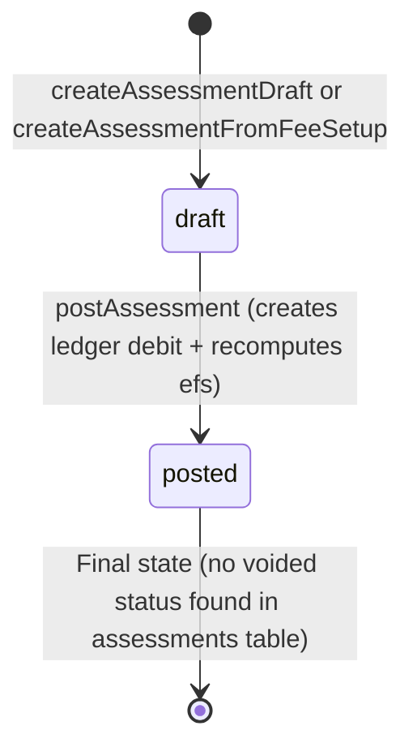
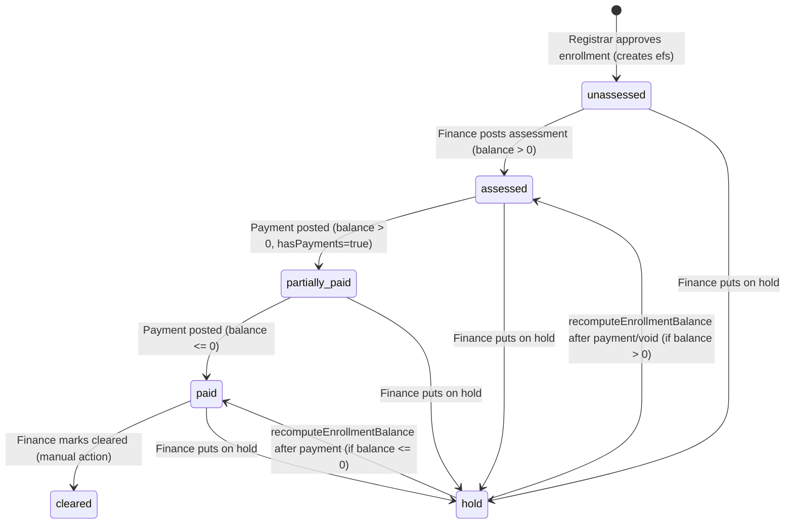
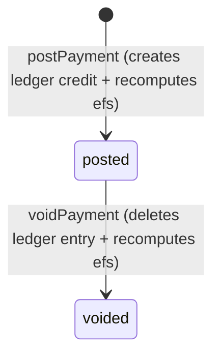

# CORUS Finance Flow Audit Report

**Date**: February 17, 2026  
**Scope**: Finance role flows + student billing view  
**Status**: Current implementation analysis + quick win implementation

---

## 1) Finance Role Summary

The **Finance** role in CORUS manages fee assessments, payment posting, clearance, and holds for approved enrollments. After registrar approves an enrollment, `enrollment_finance_status` (efs) is created with status='unassessed' and balance='0', signaling Finance to create an assessment. Finance uses a ledger-based system (`ledger_entries`) with debit (assessments) and credit (payments) entries. The `recomputeEnrollmentBalance` function sums ledger entries and updates efs status (unassessed → assessed → partially_paid → paid → cleared) based on balance. Finance can generate assessments from fee setup templates (tuition per unit + lab/misc/other fees calculated by curriculum), post assessments (creates ledger debit + updates efs to 'assessed'), post payments (creates ledger credit + recomputes balance), mark enrollments cleared (only when balance=0 and no hold), and place/remove finance holds. Students see read-only billing at `/student/billing` with efs status, total assessed, total paid, and balance, plus payment history. The assessment form mimics PH enrollment forms with student info, subjects list (Part I), and fee breakdown (Part II).

---

## 2) Step-by-step Current Flow

### **A) Finance Dashboard**

#### **Step 1: View Dashboard**
- **Route**: `/finance` ([app/(portal)/finance/page.tsx](app/(portal)/finance/page.tsx))
- **Data loading**:
  - `getApprovedEnrollmentsNeedingAssessment()` → enrollments with efs.status='unassessed' and no assessment
  - `getEnrollmentsForClearance()` → enrollments with efs.status='paid'
  - `getCollectionsReport(startOfMonth, endOfMonth)` → sum of posted payments this month
- **UI**: Cards showing counts with links: "Enrollments Needing Assessment", "Ready for Clearance", "Collected This Month"
- **DB READ**: `enrollments`, `enrollment_finance_status`, `assessments`, `payments`

### **B) Assessments Creation & Posting**

#### **Step 1: View Assessments Page**
- **Route**: `/finance/assessments` ([app/(portal)/finance/assessments/page.tsx](app/(portal)/finance/assessments/page.tsx))
- **Data loading**:
  - `getApprovedEnrollmentsNeedingAssessment()` → options for CreateAssessmentForm
  - `getAssessmentsList()` → existing assessments (draft/posted)
- **UI**: CreateAssessmentForm (manual entry), GenerateFromFeeSetupButton (template-based), table of assessments with status badges, "Form" link, PostAssessmentButton for drafts
- **DB READ**: `enrollments`, `students`, `school_years`, `terms`, `enrollment_finance_status`, `assessments`, `assessment_lines`

#### **Step 2: Create Draft Assessment (Manual)**
- **Route**: Same page, via CreateAssessmentForm
- **Action**: `createAssessmentAction(enrollmentId, lines, notes)` ([app/(portal)/finance/assessments/actions.ts](app/(portal)/finance/assessments/actions.ts) line 31)
  - **Validation**: enrollment.status === 'approved', at least one line
  - Calls `createAssessmentDraft(enrollmentId, lines, notes)` ([lib/finance/queries.ts](lib/finance/queries.ts) line 452)
  - Computes subtotal (sum of line totals), sets total = subtotal (no discounts logic)
  - **DB INSERT**: `assessments` (status='draft', subtotal, total, notes)
  - **DB INSERT**: `assessment_lines` (one per line with feeItemId, description, category, amount, qty, lineTotal, sortOrder)
  - Revalidates: `/finance/assessments`
- **DB WRITE**: `assessments`, `assessment_lines`

#### **Step 3: Generate Assessment from Fee Setup**
- **Route**: Same page, via GenerateFromFeeSetupButton
- **Action**: `generateAssessmentFromFeeSetupAction(enrollmentId, feeSetupId?)` ([app/(portal)/finance/assessments/actions.ts](app/(portal)/finance/assessments/actions.ts) line 105)
  - **Validation**: enrollment.status === 'approved'
  - Fetches published curriculum for enrollment (program, schoolYear, term, yearLevel) → total units, lab subject count
  - If feeSetupId not provided, calls `findBestApprovedFeeSetup(enrollmentId)` → matches program, yearLevel, schoolYear, term
  - Fee setup must have Program Head + Dean approval (checks `fee_setup_approvals.programHeadStatus` and `deanStatus`)
  - Computes tuition: totalUnits × tuitionPerUnit
  - Computes lab fees: labFee amount × labSubjectCount
  - Computes misc/other fees from fee setup lines
  - Calls `createAssessmentFromFeeSetup(...)` ([db/queries.ts](db/queries.ts))
  - **DB INSERT**: `assessments` (status='draft', feeSetupId, totalUnits, tuitionPerUnit, tuitionAmount, labTotal, miscTotal, otherTotal, total)
  - **DB INSERT**: `assessment_lines` (tuition line + fee setup lines with sourceFeeSetupLineId)
  - Revalidates: `/finance/assessments`
- **DB WRITE**: `assessments`, `assessment_lines`

#### **Step 4: Post Assessment**
- **Route**: Same page or assessment form, via PostAssessmentButton
- **Action**: `postAssessmentAction(assessmentId)` ([app/(portal)/finance/assessments/actions.ts](app/(portal)/finance/assessments/actions.ts) line 246)
  - Calls `postAssessment(assessmentId, userId)` ([lib/finance/queries.ts](lib/finance/queries.ts) line 543)
  - **Validation**: assessment.status === 'draft', enrollment.status === 'approved'
  - **DB UPDATE**: `assessments.status = 'posted'`, `assessments.postedByUserId`, `assessments.assessedAt`, `assessments.postedAt`
  - **DB INSERT**: `ledger_entries` (one per assessment line with entryType='assessment', debit=lineTotal, credit=0, description, category)
  - Calls `recomputeEnrollmentBalance(enrollmentId, userId)` ([lib/finance/recomputeEnrollmentBalance.ts](lib/finance/recomputeEnrollmentBalance.ts))
    - Sums `ledger_entries` (debit - credit) for enrollmentId
    - If balance <= 0: status='paid'; else if hasPayments: status='partially_paid'; else: status='assessed'
    - **DB UPDATE**: `enrollment_finance_status.balance`, `enrollment_finance_status.status`
  - **DB INSERT**: `audit_logs` (action='ASSESSMENT_POST')
  - Revalidates: `/finance/assessments`, `/finance`
- **DB WRITE**: `assessments`, `ledger_entries`, `enrollment_finance_status`, `audit_logs`

#### **Step 5: View Assessment Form (Printable)**
- **Route**: `/finance/assessments/[assessmentId]/form` ([app/(portal)/finance/assessments/[assessmentId]/form/page.tsx](app/(portal)/finance/assessments/[assessmentId]/form/page.tsx))
- **Data loading**: `getAssessmentFormData(assessmentId)` → assessment, student, enrollment, lines, scheduleSubjects
- **UI**: 
  - Header: "CORUS Official Enrollment / Assessment Form"
  - Student info: name, student no, program, year level, school year, term
  - Part I – Student Registration (Subjects): table with subject code, units, title, prereq, with lab
  - Part II – Assessment of Fees: table with description, amount; summary box (tuition, lab, misc & other, total)
  - Footer: signature lines (Student, Program Head, Dean)
  - PrintButton (triggers window.print via CSS print styles)
- **DB READ**: `assessments`, `assessment_lines`, `students`, `enrollments`, `schedules`, `subjects`

### **C) Payments Posting**

#### **Step 1: View Payments Page**
- **Route**: `/finance/payments` ([app/(portal)/finance/payments/page.tsx](app/(portal)/finance/payments/page.tsx))
- **UI**: PostPaymentForm (search student → select enrollment → enter amount, method, reference no, remarks → post)
- **DB READ**: None (form triggers actions)

#### **Step 2: Search Student & Select Enrollment**
- **Action**: `searchStudentsAction(search)` ([app/(portal)/finance/payments/actions.ts](app/(portal)/finance/payments/actions.ts) line 18)
  - Calls `searchStudentsByCodeOrName(search)` ([lib/finance/queries.ts](lib/finance/queries.ts))
  - Returns students matching studentCode or name (LIKE query)
- **Action**: `getEnrollmentsForStudentAction(studentId)` ([app/(portal)/finance/payments/actions.ts](app/(portal)/finance/payments/actions.ts) line 24)
  - Calls `getApprovedEnrollmentsByStudent(studentId)` → enrollments with status='approved', joins efs for balance
  - Returns enrollments with schoolYear, term, program, yearLevel, balance
- **DB READ**: `students`, `enrollments`, `enrollment_finance_status`

#### **Step 3: Post Payment**
- **Route**: Same page, via PostPaymentForm submit
- **Action**: `postPaymentAction(formData)` ([app/(portal)/finance/payments/actions.ts](app/(portal)/finance/payments/actions.ts) line 30)
  - **Fields**: studentId, enrollmentId, amount, method (cash/gcash/bank/card/other), referenceNo, remarks
  - **Validation**: studentId, enrollmentId, amount > 0, valid method
  - Calls `postPayment({ studentId, enrollmentId, amount, method, referenceNo, remarks, receivedByUserId })` ([lib/finance/queries.ts](lib/finance/queries.ts) line 624)
  - **DB INSERT**: `payments` (status='posted', amount, method, referenceNo, remarks, receivedByUserId, receivedAt)
  - **DB INSERT**: `ledger_entries` (entryType='payment', debit=0, credit=amount, paymentId)
  - **DB INSERT**: `payment_allocations` (paymentId, enrollmentId, amount) — tracks which enrollment payment is for
  - Calls `recomputeEnrollmentBalance(enrollmentId, userId)`
  - Revalidates: `/finance/payments`, `/finance/balances`, `/finance`
- **DB WRITE**: `payments`, `ledger_entries`, `payment_allocations`, `enrollment_finance_status`

#### **Step 4: Void Payment (Optional)**
- **Action**: `voidPaymentAction(paymentId)` ([app/(portal)/finance/payments/actions.ts](app/(portal)/finance/payments/actions.ts) line 73)
  - Calls `voidPayment(paymentId, userId)` ([lib/finance/queries.ts](lib/finance/queries.ts) line 722)
  - **DB UPDATE**: `payments.status = 'voided'`, `voidedByUserId`, `voidedAt`
  - **DB DELETE**: `ledger_entries` where paymentId (removes credit)
  - Calls `recomputeEnrollmentBalance(payment.enrollmentId, userId)`
  - Revalidates: `/finance/payments`, `/finance/balances`, `/finance`
- **DB WRITE**: `payments`, `ledger_entries`, `enrollment_finance_status`

### **D) Clearance & Holds**

#### **Step 1: View Clearance Queue**
- **Route**: `/finance/clearance` ([app/(portal)/finance/clearance/page.tsx](app/(portal)/finance/clearance/page.tsx))
- **Data loading**:
  - `getEnrollmentsForClearance()` → enrollments with status='approved', efs.status='paid' ([lib/finance/queries.ts](lib/finance/queries.ts) line 217)
  - `getEnrollmentIdsWithActiveFinanceHold()` → set of enrollmentIds with governance_flags.flagType='finance_hold'
- **UI**: Table with student, school year/term, program, balance (should be 0), hold status, MarkClearedButton
- **DB READ**: `enrollments`, `students`, `school_years`, `terms`, `enrollment_finance_status`, `governance_flags`

#### **Step 2: Mark Cleared**
- **Action**: `markClearedAction(enrollmentId)` ([app/(portal)/finance/clearance/actions.ts](app/(portal)/finance/clearance/actions.ts) line 16)
  - **Validation**: `hasActiveFinanceHoldForEnrollment(enrollmentId)` — returns error if hold exists
  - **DB UPDATE**: `enrollment_finance_status.status = 'cleared'`, `updatedByUserId`, `updatedAt`
  - **DB INSERT**: `audit_logs` (action='CLEARANCE_MARK_CLEARED')
  - Revalidates: `/finance/clearance`, `/finance`, `/registrar/enrollments`
- **DB WRITE**: `enrollment_finance_status`, `audit_logs`

#### **Step 3: Put on Hold**
- **Action**: `putOnHoldAction(enrollmentId, reason?)` ([app/(portal)/finance/clearance/actions.ts](app/(portal)/finance/clearance/actions.ts) line 49)
  - **DB UPDATE**: `enrollment_finance_status.status = 'hold'`, `updatedByUserId`, `updatedAt`
  - **Note**: Does NOT insert governance_flags row; hold is efs status only
  - Revalidates: `/finance/clearance`, `/finance`, `/registrar/enrollments`
- **DB WRITE**: `enrollment_finance_status`

#### **Step 4: Remove Hold (Not Implemented)**
- **Evidence**: No action found for removing hold; must manually update efs.status in DB or re-post payment to trigger recompute

### **E) Fee Setup (Templates)**

#### **Step 1: View Fee Setups**
- **Route**: `/finance/fee-setup` ([app/(portal)/finance/fee-setup/page.tsx](app/(portal)/finance/fee-setup/page.tsx))
- **UI**: Create Fee Setup button, list of fee setups with status (draft/pending_approval/approved/rejected), approval statuses (Program Head, Dean)
- **Note**: Fee setups require Program Head + Dean approval before use

#### **Step 2: Create Fee Setup (Not detailed in this audit)**
- **Route**: `/finance/fee-setup/new`
- **Actions**: Create fee setup, add lines (tuition per unit, lab fee, misc fees), submit for approval
- **Approval flow**: Finance creates → Program Head approves → Dean approves → status='approved'

### **F) Student Billing View**

#### **Step 1: View Billing Page**
- **Route**: `/student/billing` ([app/(portal)/student/(dashboard)/billing/page.tsx](app/(portal)/student/(dashboard)/billing/page.tsx))
- **Pre-checks**:
  - If no enrollment for active term: displays "Complete enrollment and approval to see billing"
  - If enrollment.status === 'approved' or 'enrolled' AND missing required forms: **redirects to `/student/requirements?required=1`**
- **Data loading**:
  - `getStudentBalance(enrollmentId)` → efs
  - `getAssessmentsByEnrollment(enrollmentId)` → assessments (filters posted)
  - `getPaymentsByEnrollment(enrollmentId)` → payments (posted only)
  - `hasActiveFinanceHoldForEnrollment(enrollmentId)` → boolean
- **UI**:
  - Hold banner (amber) if active: "Account hold — contact Finance"
  - Finance status badge: efs.status (unassessed/assessed/partially_paid/paid/cleared/hold)
  - Cards: Total assessed (from posted assessment), Total paid (sum of payments), Balance due (efs.balance)
  - Payment history table: date, method, amount, reference no
  - Link to assessment form if posted
  - Message if unassessed: "Awaiting assessment from Finance"
- **DB READ**: `enrollments`, `enrollment_finance_status`, `assessments`, `payments`, `governance_flags`

#### **Step 2: View Assessment Form (Student)**
- **Route**: `/student/billing/[assessmentId]/form` ([app/(portal)/student/(dashboard)/billing/[assessmentId]/form/page.tsx](app/(portal)/student/(dashboard)/billing/[assessmentId]/form/page.tsx))
- **UI**: Same as finance assessment form (Part I – Subjects, Part II – Fees), but no print button (student can print via browser)
- **DB READ**: Same as finance assessment form

---

## 3) State Machines

### **Assessment Status Transitions**

- **Table**: `assessments.status` (enum: draft, posted)
- **Key transitions**:
  - `draft` → `posted`: Finance posts assessment via `/finance/assessments`
- **Side effects on post**:
  - `ledger_entries` rows inserted (debit entries for each assessment line)
  - `recomputeEnrollmentBalance` runs → updates efs status to 'assessed' (or 'paid' if credits >= debits)
- **Note**: No 'voided' status in assessments enum; assessments are immutable once posted

### **Enrollment Finance Status (efs) Transitions**

- **Table**: `enrollment_finance_status` (efs) with `status` (enum: unassessed, assessed, partially_paid, paid, cleared, hold)
- **Key transitions**:
  - Created when enrollment approved (registrar action): initial status='unassessed', balance='0'
  - `unassessed` → `assessed`: After assessment posted, if balance > 0
  - `assessed` → `partially_paid`: After payment posted, if balance > 0 and hasPayments=true
  - `partially_paid` → `paid`: After payment posted, if balance <= 0
  - `paid` → `cleared`: Finance manually marks cleared via `/finance/clearance` (only if no hold)
  - Any status → `hold`: Finance calls `putOnHoldAction` (manual efs.status update)
  - `hold` → computed status: `recomputeEnrollmentBalance` overrides hold with computed status (bug)
- **Student visibility**: efs.status displayed on `/student/billing` as badge

### **Payment Status Transitions**

- **Table**: `payments.status` (enum: draft, posted, voided)
- **Key transitions**:
  - `posted`: Payment created and posted in one action (no draft state in UI)
  - `posted` → `voided`: Finance voids payment via `voidPaymentAction`
- **Side effects on post**:
  - `ledger_entries` row inserted (credit entry)
  - `payment_allocations` row inserted (links payment to enrollment)
  - `recomputeEnrollmentBalance` runs
- **Side effects on void**:
  - `ledger_entries` row deleted (removes credit)
  - `recomputeEnrollmentBalance` runs

---

## 4) Touchpoints

### **Registrar → Finance Handoff**

| Registrar Action | Finance Response | Data Created | Location |
|------------------|------------------|--------------|----------|
| **Approve enrollment** | `enrollment_finance_status` created (status='unassessed', balance='0'); Finance sees enrollment in "Needing Assessment" list | `enrollment_finance_status` row | [db/queries.ts](db/queries.ts) `approveEnrollmentById` |
| **Section finalization** | If section has schedules, `enrollment_subjects` populated; Finance uses this for fee calculation (units) | `enrollment_subjects` snapshot | [lib/enrollment/finalizeEnrollmentClasses.ts](lib/enrollment/finalizeEnrollmentClasses.ts) |

### **Finance → Student Visible Updates**

| Finance Action | Student Sees | Location |
|----------------|-------------|----------|
| **Post assessment** | efs.status='assessed', "Total assessed" displays, link to assessment form appears | [app/(portal)/student/(dashboard)/billing/page.tsx](app/(portal)/student/(dashboard)/billing/page.tsx) |
| **Post payment** | efs.status updates (partially_paid or paid), "Total paid" increases, balance decreases, payment appears in history | Same billing page |
| **Mark cleared** | efs.status='cleared', badge shows "cleared" | Same billing page |
| **Put on hold** | Amber banner: "Account hold — contact Finance", efs.status='hold' | Same billing page lines 69–76 |

---

## 5) Friction & Bugs

### **Critical Issues**

1. **No "Unassessed Queue" dedicated page**
   - **Problem**: Finance dashboard shows count, but assessments page lists ALL assessments (drafts + posted). No filtered view of only unassessed enrollments.
   - **Impact**: Finance must mentally filter; can't prioritize oldest unassessed enrollments; poor UX during enrollment season.
   - **Evidence**: [app/(portal)/finance/assessments/page.tsx](app/(portal)/finance/assessments/page.tsx) calls `getApprovedEnrollmentsNeedingAssessment()` but only uses for dropdown options

2. **Student billing redirect to requirements is silent**
   - **Problem**: If enrolled student has missing required forms, `/student/billing` redirects to `/student/requirements?required=1` with no message explaining why.
   - **Impact**: Student sees billing disappear with no explanation; confusing UX.
   - **Evidence**: [app/(portal)/student/(dashboard)/billing/page.tsx](app/(portal)/student/(dashboard)/billing/page.tsx) lines 40–44

3. **Hold status overridden by recomputeEnrollmentBalance**
   - **Problem**: `putOnHoldAction` sets efs.status='hold', but `recomputeEnrollmentBalance` (called on payment post/void) overwrites with computed status (assessed/partially_paid/paid), removing hold.
   - **Impact**: Finance hold does not persist after payment actions; hold must use governance_flags instead of efs.status.
   - **Evidence**: [lib/finance/recomputeEnrollmentBalance.ts](lib/finance/recomputeEnrollmentBalance.ts) line 27–42 — always computes status, no hold check

4. **No way to remove hold via UI**
   - **Problem**: `putOnHoldAction` exists, but no `removeHoldAction`. Finance must manually update DB or wait for recompute to override.
   - **Impact**: Finance cannot self-service remove hold; requires dev intervention.
   - **Evidence**: [app/(portal)/finance/clearance/actions.ts](app/(portal)/finance/clearance/actions.ts) — only putOnHoldAction exists

5. **CreateAssessmentForm has no inline validation or preview**
   - **Problem**: Manual assessment creation form allows negative amounts, zero qty, empty lines; no total preview before submit.
   - **Impact**: Finance can create invalid assessments; must re-draft to fix.
   - **Evidence**: [app/(portal)/finance/assessments/CreateAssessmentForm.tsx](app/(portal)/finance/assessments/CreateAssessmentForm.tsx) — client form with minimal validation

### **Minor Friction**

6. **No filters on assessments page**
   - **Problem**: Assessments page shows all assessments (draft + posted); no filter by school year, term, program, status.
   - **Impact**: Hard to find specific assessment in large list.
   - **Location**: [app/(portal)/finance/assessments/page.tsx](app/(portal)/finance/assessments/page.tsx)

7. **Student billing shows "unassessed" but no ETA**
   - **Problem**: Student sees "Awaiting assessment from Finance" with no timeline (usually X days).
   - **Impact**: Unclear expectations; students contact Finance unnecessarily.
   - **Location**: [app/(portal)/student/(dashboard)/billing/page.tsx](app/(portal)/student/(dashboard)/billing/page.tsx) line 116

8. **No success toasts for finance actions**
   - **Problem**: Post assessment, post payment, mark cleared, put on hold — no user feedback after success.
   - **Impact**: User must refresh to confirm action worked; poor UX.
   - **Evidence**: Actions revalidate paths but no toast notifications

9. **Assessment form lacks "Posted on" date**
   - **Problem**: Assessment form shows student info, fees, but no "Posted by [name] on [date]" stamp.
   - **Impact**: Unclear when assessment was finalized; no audit trail on form itself.
   - **Location**: [app/(portal)/finance/assessments/[assessmentId]/form/page.tsx](app/(portal)/finance/assessments/[assessmentId]/form/page.tsx)

10. **Payment posting doesn't show enrollment balance before submit**
    - **Problem**: PostPaymentForm doesn't display current balance; Finance must navigate to balances page first.
    - **Impact**: Extra navigation; can post payment exceeding balance (overpayment).
    - **Evidence**: [app/(portal)/finance/payments/PostPaymentForm.tsx](app/(portal)/finance/payments/PostPaymentForm.tsx)

### **Bugs / Data Issues**

11. **Hold logic inconsistency: efs.status vs governance_flags**
    - **Problem**: `putOnHoldAction` sets efs.status='hold', but `markClearedAction` checks `governance_flags.flagType='finance_hold'` (different table).
    - **Impact**: Confused hold model; student billing checks one, clearance checks another; recompute overwrites efs.status='hold'.
    - **Evidence**: [app/(portal)/finance/clearance/actions.ts](app/(portal)/finance/clearance/actions.ts) line 20 checks governance_flags; line 55 updates efs.status

12. **Assessment unique constraint on enrollmentId**
    - **Problem**: Schema has `assessments_enrollment_id_unique` index; only one assessment per enrollment allowed.
    - **Impact**: Cannot create second assessment if student adds/drops subjects mid-term (must void first assessment, but no void flow).
    - **Evidence**: [db/schema.ts](db/schema.ts) line 960

13. **No "Balance remaining" shown on assessment form**
    - **Problem**: Assessment form shows total but not (total - payments) balance.
    - **Impact**: Form doesn't reflect current financial picture; student sees stale total.
    - **Location**: [app/(portal)/finance/assessments/[assessmentId]/form/page.tsx](app/(portal)/finance/assessments/[assessmentId]/form/page.tsx)

14. **getApprovedEnrollmentsNeedingAssessment excludes enrollments with draft assessments**
    - **Problem**: Query excludes ANY enrollment with an assessment row (draft or posted).
    - **Impact**: If Finance creates draft but doesn't post, enrollment disappears from "needing assessment" list; orphaned drafts.
    - **Evidence**: [lib/finance/queries.ts](lib/finance/queries.ts) line 18–54 excludes all enrollmentIds in assessments table

15. **Student billing redirects to requirements even if assessment posted**
    - **Problem**: Redirect check runs if `isApproved`, regardless of efs status; blocks billing view even if Finance posted assessment.
    - **Impact**: Student can't see assessment/balance until all requirements verified.
    - **Evidence**: [app/(portal)/student/(dashboard)/billing/page.tsx](app/(portal)/student/(dashboard)/billing/page.tsx) line 40–44

---

## 6) Improvements (Prioritized)

### **Quick Wins (1–2 days)**

#### **FW1: Create "Unassessed Queue" dedicated view**
- **Why**: Finance needs clean list of enrollments awaiting assessment with age indicators
- **Action**: Add `/finance/assessments/unassessed` page OR add tab to assessments page; show only efs.status='unassessed'; add filters (schoolYear, term, program, search); add age badges via `getAgeBadgeProps`
- **Benefit**: Prioritize oldest items, faster navigation during enrollment season
- **Files**: Create [app/(portal)/finance/assessments/unassessed/page.tsx](app/(portal)/finance/assessments/unassessed/page.tsx) or add tab to existing page; update nav

#### **FW2: Assessment builder inline validation + preview**
- **Why**: CreateAssessmentForm allows invalid input (negative amounts, zero qty); no total preview
- **Action**: Add validation (amount > 0, qty >= 1); compute + display total/subtotal before submit; disable submit if invalid
- **Benefit**: Prevent invalid assessments, fewer re-drafts
- **Files**: [app/(portal)/finance/assessments/CreateAssessmentForm.tsx](app/(portal)/finance/assessments/CreateAssessmentForm.tsx)

#### **FW3: Student billing status messaging improvements**
- **Why**: Student sees "unassessed" with no ETA; redirect to requirements is silent
- **Action**: 
  - unassessed: "Finance is preparing your assessment (usually 1–3 business days)."
  - assessed: "Balance due: ₱X. Pay via cashier."
  - partially_paid: "Remaining: ₱X"
  - paid: "Fully paid ✅ Awaiting clearance."
  - cleared: "Cleared ✅"
  - hold: "On hold — contact Finance office."
  - If redirect to requirements: show banner before redirect: "Complete required documents to view billing."
- **Benefit**: Clear expectations, reduced support queries
- **Files**: [app/(portal)/student/(dashboard)/billing/page.tsx](app/(portal)/student/(dashboard)/billing/page.tsx)

#### **FW4: Success toasts for finance actions**
- **Why**: No feedback after post assessment, post payment, mark cleared, put on hold
- **Action**: Add toast library (sonner); call `toast.success()` after each finance action success
- **Benefit**: Immediate confirmation, better UX
- **Files**: [app/(portal)/finance/assessments/PostAssessmentButton.tsx](app/(portal)/finance/assessments/PostAssessmentButton.tsx), [app/(portal)/finance/payments/PostPaymentForm.tsx](app/(portal)/finance/payments/PostPaymentForm.tsx), [app/(portal)/finance/clearance/MarkClearedButton.tsx](app/(portal)/finance/clearance/MarkClearedButton.tsx), [app/(portal)/finance/clearance/ClearanceRowActions.tsx](app/(portal)/finance/clearance/ClearanceRowActions.tsx)

#### **FW5: Fix hold logic — use governance_flags consistently**
- **Why**: `recomputeEnrollmentBalance` overwrites efs.status='hold'; hold doesn't persist
- **Action**: Change `putOnHoldAction` to insert `governance_flags` (flagType='finance_hold') instead of setting efs.status; add `removeHoldAction` to delete flag; update `recomputeEnrollmentBalance` to preserve 'hold' if governance_flags.finance_hold exists
- **Benefit**: Persistent holds, consistent hold model
- **Files**: [app/(portal)/finance/clearance/actions.ts](app/(portal)/finance/clearance/actions.ts), [lib/finance/recomputeEnrollmentBalance.ts](lib/finance/recomputeEnrollmentBalance.ts), create ClearanceRowActions with hold/unhold buttons

#### **FW6: Assessment form enhancements (posted date, balance remaining)**
- **Why**: Form lacks posted date stamp; no balance remaining shown
- **Action**: Add "Posted by [name] on [date]" below header; add "Balance Remaining: ₱X" (total - payments) in summary box; add "Status: Posted" badge
- **Benefit**: Complete audit trail on form, current financial picture
- **Files**: [app/(portal)/finance/assessments/[assessmentId]/form/page.tsx](app/(portal)/finance/assessments/[assessmentId]/form/page.tsx)

#### **FW7: Payment form show enrollment balance**
- **Why**: PostPaymentForm doesn't show current balance; risk of overpayment
- **Action**: After enrollment selected, fetch + display efs.balance; show warning if payment amount > balance; compute "New Balance" = current - payment amount
- **Benefit**: Context-aware payment posting, prevent overpayment
- **Files**: [app/(portal)/finance/payments/PostPaymentForm.tsx](app/(portal)/finance/payments/PostPaymentForm.tsx)

### **Medium Complexity (1–2 weeks)**

#### **M1: Filters on assessments page**
- **Why**: Can't filter by school year, term, program, status
- **Action**: Add AssessmentsFilters component (schoolYear, term, program, status dropdowns); pass to query; update getAssessmentsList to accept filters
- **Benefit**: Faster navigation, scales to large datasets
- **Files**: [app/(portal)/finance/assessments/page.tsx](app/(portal)/finance/assessments/page.tsx), [lib/finance/queries.ts](lib/finance/queries.ts)

#### **M2: Allow multiple assessments per enrollment (remove unique constraint)**
- **Why**: Unique constraint prevents second assessment if student adds/drops subjects
- **Action**: Remove `assessments_enrollment_id_unique` index; update UI to show "Latest Assessment" badge; ensure only one posted assessment is used for efs computation
- **Benefit**: Support mid-term adjustments without voiding
- **Files**: [db/schema.ts](db/schema.ts), migration to drop constraint

#### **M3: Add "void assessment" flow**
- **Why**: No way to void assessment if posted incorrectly
- **Action**: Add `voidAssessmentAction`; update assessment.status to 'voided'; delete ledger_entries for assessment; recompute efs
- **Benefit**: Self-service correction, audit trail preserved
- **Files**: [app/(portal)/finance/assessments/actions.ts](app/(portal)/finance/assessments/actions.ts), [app/(portal)/finance/assessments/AssessmentRowActions.tsx](app/(portal)/finance/assessments/AssessmentRowActions.tsx)

#### **M4: Fix getApprovedEnrollmentsNeedingAssessment to check posted status**
- **Why**: Excludes enrollments with draft assessments; orphans drafts
- **Action**: Change query to exclude only enrollments with assessments.status='posted'; show enrollments with draft
- **Benefit**: Drafts don't disappear from queue
- **Files**: [lib/finance/queries.ts](lib/finance/queries.ts) line 18

#### **M5: Student billing pre-assessment view (show "preparing" instead of redirect)**
- **Why**: Redirect to requirements blocks billing even if Finance working on assessment
- **Action**: Remove redirect logic; show billing page with placeholder: "Finance is preparing your assessment" + requirements checklist if missing forms
- **Benefit**: Student sees progress, less confusion
- **Files**: [app/(portal)/student/(dashboard)/billing/page.tsx](app/(portal)/student/(dashboard)/billing/page.tsx)

### **Structural (Schema Changes — Document Only, Do Not Implement)**

#### **S1: Separate hold table (replace efs.status='hold' with governance_flags only)**
- **Why**: efs.status='hold' overridden by recompute; governance_flags is proper model
- **Action**: Remove 'hold' from efs_status enum; always use governance_flags for holds; add hold_reason column; add removed_at timestamp
- **Benefit**: Persistent holds, proper audit trail

#### **S2: Add assessment.status='voided'**
- **Why**: No void flow; assessments immutable once posted
- **Action**: Add 'voided' to assessment status enum; add voidedByUserId, voidedAt columns
- **Benefit**: Support assessment corrections

#### **S3: Add payment.draft status (split create/post)**
- **Why**: Current flow creates + posts in one action; no draft step
- **Action**: Add 'draft' to payment status enum; allow creating draft payment; add post payment action
- **Benefit**: Review before posting, batch payments

---

## 7) Implementation Map

### **Quick Wins**

| ID | Improvement | Files to Change | Description |
|----|-------------|-----------------|-------------|
| FW1 | Unassessed Queue view | [app/(portal)/finance/assessments/page.tsx](app/(portal)/finance/assessments/page.tsx) or create new page | Add tab or separate page for unassessed enrollments; add filters (SY, term, program, search); use `getAgeBadgeProps` for age column; "Create Assessment" button per row |
| FW2 | Assessment builder validation | [app/(portal)/finance/assessments/CreateAssessmentForm.tsx](app/(portal)/finance/assessments/CreateAssessmentForm.tsx) | Add inline validation (amount > 0, qty >= 1); compute + display total before submit; disable submit if invalid |
| FW3 | Student billing messaging | [app/(portal)/student/(dashboard)/billing/page.tsx](app/(portal)/student/(dashboard)/billing/page.tsx) | Update status messages per efs.status; add banner before redirect to requirements explaining why |
| FW4 | Success toasts | PostAssessmentButton, PostPaymentForm, MarkClearedButton, ClearanceRowActions | Install sonner; add `toast.success()` after action success |
| FW5 | Fix hold logic | [app/(portal)/finance/clearance/actions.ts](app/(portal)/finance/clearance/actions.ts), [lib/finance/recomputeEnrollmentBalance.ts](lib/finance/recomputeEnrollmentBalance.ts) | Use governance_flags for hold; add removeHoldAction; preserve hold in recompute |
| FW6 | Assessment form enhancements | [app/(portal)/finance/assessments/[assessmentId]/form/page.tsx](app/(portal)/finance/assessments/[assessmentId]/form/page.tsx) | Add posted date, balance remaining, status badge |
| FW7 | Payment form show balance | [app/(portal)/finance/payments/PostPaymentForm.tsx](app/(portal)/finance/payments/PostPaymentForm.tsx) | Display efs.balance after enrollment selected; show "New Balance" preview |

---

## Summary

The CORUS finance flow is **functional but lacks polish**. The core journey (registrar approves → Finance creates assessment → posts assessment → posts payments → marks cleared) works via a **ledger-based system** (`ledger_entries` with debit/credit, `recomputeEnrollmentBalance` computes efs status). Assessment generation from fee setups (template-based with tuition per unit + lab/misc/other fees) is sophisticated. The assessment form mimics PH enrollment forms (Part I – Subjects, Part II – Fees) and is printable.

**Critical Issues**: No dedicated unassessed queue view (Finance must filter mentally), hold logic inconsistency (efs.status='hold' overridden by recompute), student billing silent redirect to requirements, no way to remove hold via UI, CreateAssessmentForm has no validation/preview.

**Implemented Features**: Ledger-based balance computation, fee setup templates with Program Head + Dean approval, assessment form with student info + subjects + fees breakdown, payment posting with method/reference tracking, clearance queue (paid → cleared), hold placement (but fragile).

**High-Priority Fixes**: FW1 (unassessed queue), FW3 (student billing messaging), FW5 (fix hold logic), FW4 (success toasts) for immediate UX improvement. FW2 (assessment validation) and FW7 (payment balance preview) prevent data entry errors.

**Next Steps**: Implement FW1–FW7 (quick wins), then tackle M4 (fix orphaned drafts) and M5 (student billing pre-assessment view) for workflow efficiency.
