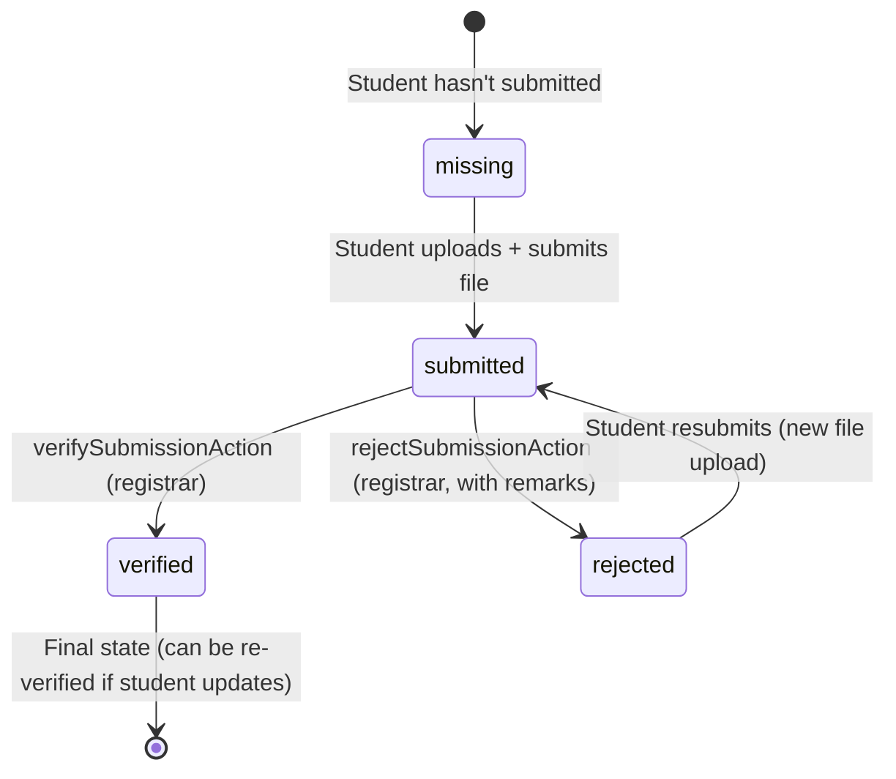
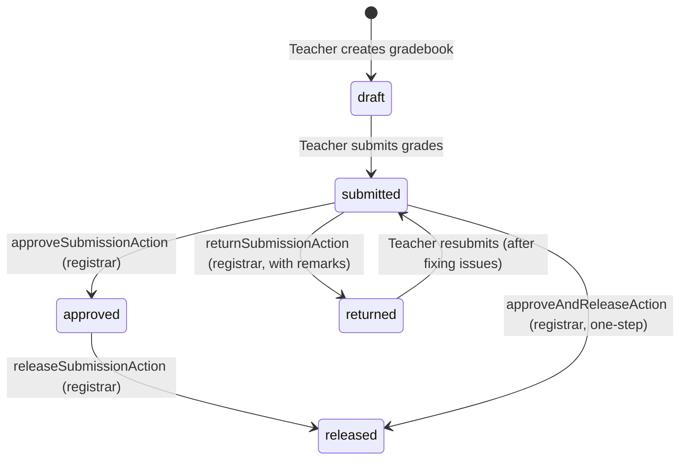
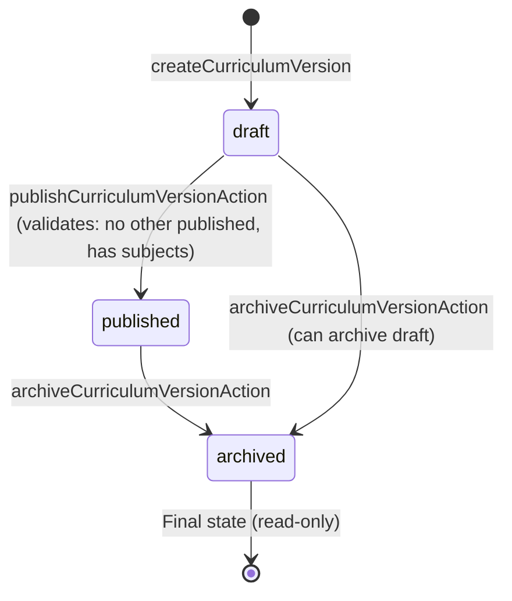
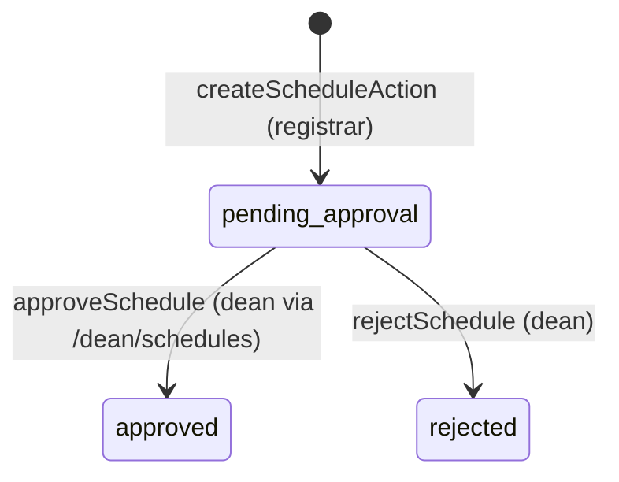

# CORUS Registrar Flow Audit Report

**Date**: February 17, 2026  
**Scope**: Registrar role flows only  
**Status**: Current implementation analysis (no code changes)

---

## 1) Registrar Role Summary

The **Registrar** role in CORUS manages enrollment approvals, requirement document verification, grade release workflows, curriculum versioning, section assignment, schedule creation, and student record management. The registrar serves as the primary gatekeeper between students and finance: when a student submits an enrollment (status=pending_approval), the registrar reviews requirement documents, verifies submissions, and approves/rejects enrollments. Upon approval, enrollment_finance_status is initialized (status=unassessed), triggering finance assessment creation. The registrar also manages curriculum versions (draft → published → archived) that feed into enrollment class finalization when sections lack schedules. Grade submissions from teachers flow through registrar approval (submitted → approved → released), making grades visible to students only after release. The registrar creates class schedules that require dean approval before becoming active. Throughout, the registrar interacts with students (enrollment/document verification), teachers (grade review), finance (enrollment approval triggers assessment eligibility), deans (schedule approvals), and program heads (optional curriculum governance). A unified Workbench at `/registrar/workbench` provides a single view of pending enrollments, requirements to verify, and grade submissions with age-based SLA indicators.

---

## 2) Step-by-step Current Flow

### **A) Enrollment Approvals**

#### **Step 1: View Pending Enrollment Queue**
- **Route**: `/registrar/approvals` ([app/(portal)/registrar/approvals/page.tsx](app/(portal)/registrar/approvals/page.tsx))
- **UI**: Table listing enrollments with status=pending_approval; `EnrollmentApprovalsFilters` for program, year level, requirements status, student search
- **Data loading**: `getPendingEnrollmentApprovalsList(search)` ([db/queries.ts](db/queries.ts) line 1191)
  - Joins: enrollments, students, school_years, terms, programs, sections, enrollment_finance_status
  - Filters: `enrollments.status = 'pending_approval'`
  - Orders by: `enrollments.createdAt DESC`
- **UI displays**: Age badge (via `getAgeBadgeProps` from [lib/ui/age.ts](lib/ui/age.ts)), student name/code, school year/term, program, year level, section, requirements badge (verified/required counts), finance status (read-only), date, actions
- **Requirements summary**: For each enrollment, calls `getEnrollmentRequirementsSummary` ([lib/requirements/enrollmentSummary.ts](lib/requirements/enrollmentSummary.ts)) to compute verified vs required counts
- **Client-side filters**: Program, yearLevel, reqsStatus (complete/incomplete) applied after fetch
- **DB READ**: `enrollments`, `students`, `school_years`, `terms`, `programs`, `sections`, `enrollment_finance_status`, `student_requirement_submissions`, `requirement_rules`

#### **Step 2: Review Enrollment Details**
- **Route**: `/registrar/approvals/[enrollmentId]/review` ([app/(portal)/registrar/approvals/[enrollmentId]/review/page.tsx](app/(portal)/registrar/approvals/[enrollmentId]/review/page.tsx))
- **Pre-check**: Verifies enrollment.status === 'pending_approval'; redirects if not
- **Data loading**:
  - `getEnrollmentById(enrollmentId)` → enrollment details
  - `getStudentById(enrollment.studentId)` → student profile
  - `getApplicableRequirements(...)` → requirement submissions with files
  - `getRequirementRequestsByEnrollment(enrollmentId)` → pending document requests
- **UI**: `EnrollmentReviewContent` component displays:
  - Student info (name, code, program, year level)
  - School year / term
  - Requirement documents list (each with status: missing/submitted/verified/rejected, file download links, verification actions)
- **DB READ**: `enrollments`, `students`, `student_requirement_submissions`, `requirements`, `requirement_rules`, `requirement_requests`

#### **Step 3: Verify/Reject Individual Documents**
- **Route**: Same review page (`/registrar/approvals/[enrollmentId]/review`)
- **Action**: `verifySubmissionAction(submissionId, messageToStudent?)` ([app/(portal)/registrar/requirements/actions.ts](app/(portal)/registrar/requirements/actions.ts) line 197)
  - Calls `verifySubmission(submissionId, verifiedByUserId, messageToStudent)` ([db/queries.ts](db/queries.ts) line 2590)
  - **DB UPDATE**: `student_requirement_submissions.status = 'verified'`, `verifiedByUserId`, `verifiedAt`, `registrarRemarks` (if message provided)
  - **DB INSERT**: `audit_logs` (action='requirement_verify')
  - Revalidates: `/registrar/requirements`, `/registrar/requirements/queue`, `/registrar/approvals`, `/student/requirements`, `/registrar/students/[studentId]`
- **Action**: `rejectSubmissionAction(submissionId, remarks)` ([app/(portal)/registrar/requirements/actions.ts](app/(portal)/registrar/requirements/actions.ts) line 217)
  - Calls `rejectSubmission(submissionId, remarks)` ([db/queries.ts](db/queries.ts) line 2617)
  - **DB UPDATE**: `student_requirement_submissions.status = 'rejected'`, `registrarRemarks = remarks`
  - **DB INSERT**: `audit_logs` (action='requirement_reject')
  - Revalidates: same paths as verify
- **DB WRITE**: `student_requirement_submissions`, `audit_logs`

#### **Step 4: Request Missing Documents (Optional)**
- **Route**: Same review page
- **Action**: `createRequirementRequestAction(enrollmentId, submissionId, message?)` ([app/(portal)/registrar/approvals/actions.ts](app/(portal)/registrar/approvals/actions.ts) line 88)
  - Calls `createRequirementRequest(...)` ([db/queries.ts](db/queries.ts))
  - **DB INSERT**: `requirement_requests` (status='pending', requestedByUserId, message)
  - Revalidates: `/registrar/approvals`, `/registrar/approvals/[enrollmentId]/review`, `/registrar/students/[studentId]`, `/student/enrollment`, `/student/requirements`
- **DB WRITE**: `requirement_requests`

#### **Step 5: Approve Enrollment**
- **Route**: Same review page or approvals list page
- **UI**: `EnrollmentApprovalActions` component ([app/(portal)/registrar/approvals/EnrollmentApprovalActions.tsx](app/(portal)/registrar/approvals/EnrollmentApprovalActions.tsx))
  - Shows "Approve" button (disabled if not all required docs verified)
  - Shows "Override and approve" button if docs not all verified (requires remarks)
  - Shows "Reject" button
- **Action**: `approveEnrollment(enrollmentId, options?)` ([app/(portal)/registrar/approvals/actions.ts](app/(portal)/registrar/approvals/actions.ts) line 21)
  - **Validation**: If override=false, checks `getEnrollmentRequirementsSummary`; if required > 0 and verified < required, returns error
  - **Validation**: If override=true, requires remarks (returns error if missing)
  - Calls `approveEnrollmentById(enrollmentId, reviewedByUserId, remarks)` ([db/queries.ts](db/queries.ts) line 1347)
    - **DB UPDATE**: `enrollments.status = 'approved'`
    - **DB INSERT/UPDATE**: `enrollment_approvals` (status='approved', reviewedByUserId, reviewedAt, remarks)
    - **DB INSERT**: `enrollment_finance_status` (if not exists) with enrollmentId, status='unassessed', balance='0'
  - Calls `finalizeEnrollmentClasses(enrollmentId)` ([lib/enrollment/finalizeEnrollmentClasses.ts](lib/enrollment/finalizeEnrollmentClasses.ts) line 27)
    - **Scenario A (section has schedules)**: Creates `class_offerings` per schedule, inserts `student_class_enrollments`, inserts `enrollment_subjects` snapshot from schedules
    - **Scenario B (no section schedules yet)**: Inserts `enrollment_subjects` from published curriculum (program + year level + term)
  - **DB INSERT**: `audit_logs` (action='ENROLLMENT_APPROVE', after={override, remarks} if override)
  - Revalidates: `/registrar`, `/registrar/approvals`, `/finance/assessments`
- **DB WRITE**: `enrollments`, `enrollment_approvals`, `enrollment_finance_status`, `class_offerings`, `student_class_enrollments`, `enrollment_subjects`, `audit_logs`

#### **Step 6: Reject Enrollment**
- **Route**: Same review page or approvals list page
- **Action**: `rejectEnrollment(enrollmentId, remarks)` ([app/(portal)/registrar/approvals/actions.ts](app/(portal)/registrar/approvals/actions.ts) line 71)
  - Calls `rejectEnrollmentById(enrollmentId, reviewedByUserId, remarks)` ([db/queries.ts](db/queries.ts) line 1405)
  - **DB UPDATE**: `enrollments.status = 'rejected'`
  - **DB INSERT/UPDATE**: `enrollment_approvals` (status='rejected', reviewedByUserId, reviewedAt, remarks)
  - Revalidates: `/registrar`, `/registrar/approvals`, `/student/enrollment`
- **DB WRITE**: `enrollments`, `enrollment_approvals`

#### **Step 7: Assign Section to Approved Enrollment (Post-approval)**
- **Route**: `/registrar/enrollments` ([app/(portal)/registrar/enrollments/page.tsx](app/(portal)/registrar/enrollments/page.tsx))
- **Action**: `assignSectionToEnrollmentAction(enrollmentId, sectionId)` ([app/(portal)/registrar/enrollments/actions.ts](app/(portal)/registrar/enrollments/actions.ts) line 103)
  - Calls `updateEnrollmentSection(enrollmentId, sectionId)` ([db/queries.ts](db/queries.ts))
  - **DB UPDATE**: `enrollments.sectionId = sectionId`
  - If enrollment.status === 'approved' or 'enrolled', calls `finalizeEnrollmentClasses(enrollmentId)` to recreate class enrollments from section schedules
  - Revalidates: `/registrar/enrollments`, `/registrar/students/[studentId]`
- **DB WRITE**: `enrollments`, `class_offerings`, `student_class_enrollments`, `enrollment_subjects`

---

### **B) Requirements Verification**

#### **Step 1: View Requirements Queue**
- **Route**: `/registrar/requirements/queue` ([app/(portal)/registrar/requirements/queue/page.tsx](app/(portal)/registrar/requirements/queue/page.tsx))
- **Data loading**: `getQueueSubmissions(filters)` ([db/queries.ts](db/queries.ts) line 2759)
  - Filters: `student_requirement_submissions.status = 'submitted'`
  - Optional filters: schoolYearId, termId, program, search (student name/code)
  - Joins: students, requirements, enrollments
- **UI**: `QueueTable` component ([app/(portal)/registrar/requirements/queue/QueueTable.tsx](app/(portal)/registrar/requirements/queue/QueueTable.tsx))
  - Displays: Student name/code, requirement name/code, program/year level, submitted date, verify/reject actions
- **DB READ**: `student_requirement_submissions`, `students`, `requirements`, `enrollments`

#### **Step 2: Verify Submission from Queue**
- **Route**: Same queue page
- **Action**: `verifySubmissionAction(submissionId, messageToStudent?)` ([app/(portal)/registrar/requirements/actions.ts](app/(portal)/registrar/requirements/actions.ts) line 197)
  - Same flow as enrollment review verification (Step 3 above)
- **DB WRITE**: `student_requirement_submissions`, `audit_logs`

#### **Step 3: Reject Submission from Queue**
- **Route**: Same queue page
- **Action**: `rejectSubmissionAction(submissionId, remarks)` ([app/(portal)/registrar/requirements/actions.ts](app/(portal)/registrar/requirements/actions.ts) line 217)
  - Requires remarks (returns error if empty)
  - Same flow as enrollment review rejection (Step 3 above)
- **DB WRITE**: `student_requirement_submissions`, `audit_logs`

#### **Step 4: Manage Master Requirements & Rules**
- **Route**: `/registrar/requirements` ([app/(portal)/registrar/requirements/page.tsx](app/(portal)/registrar/requirements/page.tsx))
- **Tabs**: "Master requirements" and "Rules / applicability"
- **Master requirements**: Create/edit/delete requirements (code, name, description, instructions, allowedFileTypes, maxFiles, isActive)
  - Actions: `createRequirementAction`, `updateRequirementAction`, `deleteRequirementAction`, `toggleRequirementActiveAction` ([app/(portal)/registrar/requirements/actions.ts](app/(portal)/registrar/requirements/actions.ts))
- **Rules**: Create/edit/delete requirement rules (appliesTo: enrollment/clearance/graduation, program, yearLevel, schoolYearId, termId, isRequired, sortOrder)
  - Actions: `createRuleAction`, `updateRuleAction`, `deleteRuleAction` ([app/(portal)/registrar/requirements/actions.ts](app/(portal)/registrar/requirements/actions.ts))
- **DB WRITE**: `requirements`, `requirement_rules`

---

### **C) Grade Release Workflow**

#### **Step 1: View Grade Submissions Queue**
- **Route**: `/registrar/grades` ([app/(portal)/registrar/grades/page.tsx](app/(portal)/registrar/grades/page.tsx))
- **Data loading**: `listGradeSubmissionsForRegistrar(filters)` ([db/queries.ts](db/queries.ts))
  - Filters: schoolYearId, termId, status (submitted/returned/approved/released)
  - Joins: grade_submissions, subjects, sections, grading_periods, teachers
- **UI**: `RegistrarGradesFilters` for school year/term; tabs for "Submitted", "Returned", "Approved", "Released"
  - Each row shows: subject, section, grading period, teacher, age badge (via `getAgeBadgeProps`), status badge, date, `GradeRowActions` (approve, approve & release, release)
- **DB READ**: `grade_submissions`, `subjects`, `sections`, `grading_periods`, `user_profiles` (teachers)

#### **Step 2: Review Grade Submission**
- **Route**: `/registrar/grades/[submissionId]` ([app/(portal)/registrar/grades/[submissionId]/page.tsx](app/(portal)/registrar/grades/[submissionId]/page.tsx))
- **Data loading**:
  - `getGradeSubmissionWithDetails(submissionId)` → submission metadata
  - `getGradeEntriesBySubmissionId(submissionId)` → roster grades (read-only)
  - `getAuditLogPage({ entityType: 'grade_submission', entityId: submissionId })` → history
- **UI**: Displays subject, section, grading period, teacher, submission date, status badge, grade entries table, return remarks (if returned), audit history (chronological)
- **Actions**: `SubmissionActions` component ([app/(portal)/registrar/grades/[submissionId]/SubmissionActions.tsx](app/(portal)/registrar/grades/[submissionId]/SubmissionActions.tsx))
  - Shows actions based on status: submitted → approve/return, approved → release, returned → (no actions, teacher must resubmit)
- **DB READ**: `grade_submissions`, `grade_entries`, `students`, `audit_logs`

#### **Step 3: Approve Grade Submission**
- **Route**: Same review page or grades list (via `GradeRowActions`)
- **Action**: `approveSubmissionAction(submissionId)` ([app/(portal)/registrar/grades/actions.ts](app/(portal)/registrar/grades/actions.ts) line 30)
  - Validates: status === 'submitted'
  - Calls `approveGradeSubmission(submissionId, registrarUserId)` ([db/queries.ts](db/queries.ts) line 3376)
  - **DB UPDATE**: `grade_submissions.status = 'approved'`, `registrarReviewedByUserId`, `registrarReviewedAt`, `approvedAt`
  - **DB INSERT**: `audit_logs` (action='GRADE_APPROVE')
  - Revalidates: `/registrar/grades`
- **DB WRITE**: `grade_submissions`, `audit_logs`

#### **Step 4: Return Grade Submission**
- **Route**: Same review page
- **Action**: `returnSubmissionAction(submissionId, remarks)` ([app/(portal)/registrar/grades/actions.ts](app/(portal)/registrar/grades/actions.ts) line 13)
  - Validates: status === 'submitted'
  - Calls `returnGradeSubmission(submissionId, registrarUserId, remarks)` ([db/queries.ts](db/queries.ts) line 3359)
  - **DB UPDATE**: `grade_submissions.status = 'returned'`, `registrarReviewedByUserId`, `registrarReviewedAt`, `registrarRemarks`
  - **DB INSERT**: `audit_logs` (action='GRADE_RETURN')
  - Revalidates: `/registrar/grades`
- **DB WRITE**: `grade_submissions`, `audit_logs`

#### **Step 5: Release Approved Grades**
- **Route**: Same review page or grades list (via `GradeRowActions`)
- **Action**: `releaseSubmissionAction(submissionId)` ([app/(portal)/registrar/grades/actions.ts](app/(portal)/registrar/grades/actions.ts) line 47)
  - Validates: status === 'approved'
  - Calls `releaseGradeSubmission(submissionId)` ([db/queries.ts](db/queries.ts) line 3389)
  - **DB UPDATE**: `grade_submissions.status = 'released'`, `releasedAt`
  - **DB INSERT**: `audit_logs` (action='GRADE_RELEASE')
  - Revalidates: `/registrar/grades`
- **Note**: Only grades with status='released' are visible to students on `/student/grades`
- **DB WRITE**: `grade_submissions`, `audit_logs`

#### **Step 6: Approve and Release in One Action**
- **Route**: Same review page or grades list (via `GradeRowActions`)
- **Action**: `approveAndReleaseAction(submissionId)` ([app/(portal)/registrar/grades/actions.ts](app/(portal)/registrar/grades/actions.ts) line 64)
  - Validates: status === 'submitted'
  - Calls `approveGradeSubmission` then `releaseGradeSubmission` sequentially
  - **DB INSERT**: `audit_logs` (action='GRADE_RELEASE' only, not GRADE_APPROVE)
  - Revalidates: `/registrar/grades`
- **DB WRITE**: `grade_submissions`, `audit_logs`

---

### **D) Curriculum Management**

#### **Step 1: View Curriculum Versions**
- **Route**: `/registrar/curriculum` ([app/(portal)/registrar/curriculum/page.tsx](app/(portal)/registrar/curriculum/page.tsx))
- **Query params**: programId, schoolYearId, yearLevel (1st Year/2nd Year/3rd Year/4th Year), view (draft/published)
- **Data loading**:
  - `getProgramsList(true)` → active programs
  - `getSchoolYearsList()` → school years
  - `getCurriculumVersionsList({programId, schoolYearId, status: 'draft'})` → draft versions
  - `getCurriculumVersionsList({programId, schoolYearId, status: 'published'})` → published versions
- **UI**: `CurriculumPageHeader`, `CurriculumContextBar`, `CurriculumBuilder` components
  - Shows program/year level tabs, draft vs published toggle (if both exist)
  - Displays curriculum blocks (per year level + term) with subjects
- **DB READ**: `curriculum_versions`, `curriculum_blocks`, `curriculum_block_subjects`, `programs`, `school_years`, `terms`, `subjects`

#### **Step 2: Create Draft Curriculum**
- **Route**: Same curriculum page
- **Action**: `createCurriculumForProgramYearAction(programId, schoolYearId, name)` ([app/(portal)/registrar/curriculum/actions.ts](app/(portal)/registrar/curriculum/actions.ts) line 29)
  - Checks if draft already exists (returns existing if found)
  - Calls `createCurriculumVersion(...)` ([db/queries.ts](db/queries.ts))
  - **DB INSERT**: `curriculum_versions` (status='draft', programId, schoolYearId, name, createdByUserId)
  - Revalidates: `/registrar/curriculum`
- **DB WRITE**: `curriculum_versions`

#### **Step 3: Add Subjects to Curriculum Blocks**
- **Route**: Same curriculum page (draft mode)
- **Actions**:
  - `addSubjectToBlockAction(...)` ([app/(portal)/registrar/curriculum/actions.ts](app/(portal)/registrar/curriculum/actions.ts) line 116)
  - `addSubjectsToBlockAction(...)` ([app/(portal)/registrar/curriculum/actions.ts](app/(portal)/registrar/curriculum/actions.ts) line 332)
  - `addSubjectsToYearAction(...)` ([app/(portal)/registrar/curriculum/actions.ts](app/(portal)/registrar/curriculum/actions.ts) line 419)
- **Validation**: Only draft versions can be edited (returns error if status !== 'draft')
- **Validation**: Subject must be valid for program (isGe=true OR programId matches)
- **DB Operations**:
  - `getOrCreateCurriculumBlock(...)` → creates block if missing (yearLevel + termId)
  - `addCurriculumBlockSubject(...)` → adds subject to block
- **DB WRITE**: `curriculum_blocks`, `curriculum_block_subjects`

#### **Step 4: Publish Curriculum**
- **Route**: Same curriculum page
- **Action**: `publishCurriculumVersionAction(versionId)` ([app/(portal)/registrar/curriculum/actions.ts](app/(portal)/registrar/curriculum/actions.ts) line 167)
  - **Validation**: status === 'draft' (returns error if not)
  - **Validation**: No other published curriculum for same program + schoolYear (returns error if exists)
  - **Validation**: At least one block has at least one subject (returns error if empty)
  - Calls `updateCurriculumVersionStatus(versionId, 'published')` ([db/queries.ts](db/queries.ts) line 3774)
  - **DB UPDATE**: `curriculum_versions.status = 'published'`
  - Revalidates: `/registrar/curriculum`
- **Note**: Published curriculum is used by `finalizeEnrollmentClasses` when section has no schedules (Scenario B)
- **DB WRITE**: `curriculum_versions`

#### **Step 5: Archive Curriculum**
- **Route**: Same curriculum page
- **Action**: `archiveCurriculumVersionAction(versionId)` ([app/(portal)/registrar/curriculum/actions.ts](app/(portal)/registrar/curriculum/actions.ts) line 198)
  - Calls `updateCurriculumVersionStatus(versionId, 'archived')`
  - **DB UPDATE**: `curriculum_versions.status = 'archived'`
  - Revalidates: `/registrar/curriculum`
- **DB WRITE**: `curriculum_versions`

#### **Step 6: Clone Curriculum**
- **Route**: Same curriculum page
- **Action**: `cloneCurriculumVersionAction(...)` ([app/(portal)/registrar/curriculum/actions.ts](app/(portal)/registrar/curriculum/actions.ts) line 70)
  - Copies curriculum version, blocks, and block subjects to new program/schoolYear
  - Creates new draft version
- **DB WRITE**: `curriculum_versions`, `curriculum_blocks`, `curriculum_block_subjects`

---

### **E) Sections & Enrollment Records**

#### **Step 1: Create Enrollment (Registrar-initiated)**
- **Route**: `/registrar/enrollments` ([app/(portal)/registrar/enrollments/page.tsx](app/(portal)/registrar/enrollments/page.tsx))
- **Action**: `createEnrollmentAction(formData)` ([app/(portal)/registrar/enrollments/actions.ts](app/(portal)/registrar/enrollments/actions.ts) line 16)
  - Fields: studentId, schoolYearId, termId, programId, yearLevel, sectionId (optional)
  - **Auto-assignment**: If sectionId not provided and yearLevel provided, calls `pickBalancedSectionForEnrollment(...)` to auto-assign section
  - Calls `createEnrollment(...)` ([db/queries.ts](db/queries.ts))
  - **DB INSERT**: `enrollments` (status='pending_approval' by default)
  - Revalidates: `/registrar/enrollments`, `/registrar`, `/registrar/students/[studentId]`
- **DB WRITE**: `enrollments`

#### **Step 2: Assign Section to Enrollment**
- **Route**: Same enrollments page
- **Action**: `assignSectionToEnrollmentAction(enrollmentId, sectionId)` (see A) Step 7)
- **DB WRITE**: `enrollments`, `class_offerings`, `student_class_enrollments`, `enrollment_subjects`

---

### **F) Schedules**

#### **Step 1: Create Class Schedule**
- **Route**: `/registrar/schedules` ([app/(portal)/registrar/schedules/page.tsx](app/(portal)/registrar/schedules/page.tsx))
- **Action**: `createScheduleAction(formData)` ([app/(portal)/registrar/schedules/actions.ts](app/(portal)/registrar/schedules/actions.ts) line 20)
  - Fields: schoolYearId, termId, sectionId, subjectId, teacherId, room, timeIn, timeOut, days[]
  - **Validation**: `isSubjectAllowedForSection(subjectId, sectionId)` → checks if subject is GE or matches section's program
  - **Validation**: `validateTeacherCapability(teacherId, subjectId)` → checks if teacher is approved to teach subject
  - Calls `createScheduleWithDays(...)` ([db/queries.ts](db/queries.ts))
  - **DB INSERT**: `class_schedules` (status='pending_approval')
  - **DB INSERT**: `schedule_approvals` (status='pending', submittedByUserId=registrar)
  - **Note**: Schedule requires dean approval before becoming active (dean approves via `/dean/schedules`)
  - Revalidates: `/registrar/schedules`, `/program-head/schedules`, `/registrar`
- **DB WRITE**: `class_schedules`, `schedule_approvals`

---

### **G) Registrar Dashboard & Workbench**

#### **Step 1: View Dashboard**
- **Route**: `/registrar` ([app/(portal)/registrar/page.tsx](app/(portal)/registrar/page.tsx))
- **Data loading**:
  - `getPendingEnrollmentApprovalsCount()` → count of pending enrollments
  - `getActiveEnrollmentsCount()` → count of approved/enrolled enrollments
  - `getRequirementVerificationsAwaitingCount()` → count of submitted requirements
  - `getGradeSubmissionsAwaitingReviewCount()` → count of submitted grade submissions
  - `getPendingClearancesCount()` → count of paid but not cleared enrollments
  - `getRecentlyCompletedProfilesCount()` → new registrations (last 7 days)
  - `getAnnouncementsThisWeekCount()` → announcements this week
  - `getLatestPendingEnrollmentApprovals(10)` → recent pending enrollments
  - `getRecentRequirementSubmissions(10)` → recent requirement submissions
  - `getRecentGradeSubmissions(10)` → recent grade submissions
  - `getRecentlyCompletedProfiles(10)` → recent student registrations
  - `getRecentAnnouncements(5)` → recent announcements
- **UI**: Cards showing counts with links to queues; "Open Workbench →" button; recent activity lists
- **DB READ**: `enrollments`, `student_requirement_submissions`, `grade_submissions`, `enrollment_finance_status`, `students`, `announcements`

#### **Step 2: View Workbench (Unified Queue)**
- **Route**: `/registrar/workbench` ([app/(portal)/registrar/workbench/page.tsx](app/(portal)/registrar/workbench/page.tsx))
- **Data loading**:
  - `getPendingEnrollmentApprovalsCount()`, `getRequirementVerificationsAwaitingCount()`, `getGradeSubmissionsAwaitingReviewCount()`
  - `getPendingEnrollmentApprovalsList()` (top 25), `getQueueSubmissions({})` (top 25), `listGradeSubmissionsForRegistrar({ status: 'submitted' })` (top 25)
  - `getEnrollmentRequirementsSummary` per enrollment
- **UI**: Tabbed view (Enrollments, Requirements, Grades) with summary cards; each table has Age column via `getAgeBadgeProps`; links to review/queue pages
- **DB READ**: Same as individual queues
- **SLA visibility**: Age badges (0–2 days: default, 3–6 days: secondary/amber, 7+ days: destructive/red) per [lib/ui/age.ts](lib/ui/age.ts)

---

## 3) State Machines

### **Enrollment Approval State Machine (Registrar View)**

```mermaid
stateDiagram-v2
    [*] --> pending_approval: Student submits enrollment
    pending_approval --> approved: approveEnrollment (all docs verified OR override with remarks)
    pending_approval --> rejected: rejectEnrollment (with remarks)
    rejected --> [*]: Student can resubmit (creates new enrollment)
    approved --> enrolled: Not found in codebase (no explicit transition; both treated as enrolled)
    approved --> approved: assignSectionToEnrollment (triggers finalizeEnrollmentClasses)
```

- **Table**: `enrollments.status` (enum: preregistered, pending_approval, approved, rejected, enrolled, cancelled)
- **Key transitions**:
  - `pending_approval` → `approved`: Registrar approves via `/registrar/approvals/[enrollmentId]/review`
  - `pending_approval` → `rejected`: Registrar rejects with remarks
  - `approved` → (no explicit transition to `enrolled`; both statuses treated as "enrolled" in UI)
- **Side effects on approve**:
  - `enrollment_approvals` row inserted/updated (status='approved')
  - `enrollment_finance_status` row created if not exists (status='unassessed', balance='0')
  - `finalizeEnrollmentClasses` runs (creates class enrollments, populates enrollment_subjects)

### **Requirement Verification State Machine (Registrar View)**

- **Table**: `student_requirement_submissions.status` (enum: missing, submitted, verified, rejected)
- **Key transitions**:
  - `submitted` → `verified`: Registrar verifies via `/registrar/requirements/queue` or enrollment review page
  - `submitted` → `rejected`: Registrar rejects with remarks
  - `rejected` → `submitted`: Student resubmits (new file upload)
- **Enrollment approval dependency**: `approveEnrollment` checks if all required documents are verified (unless override=true)

### **Grade Approval/Release State Machine (Registrar View)**

- **Table**: `grade_submissions.status` (enum: draft, submitted, returned, approved, released)
- **Key transitions**:
  - `submitted` → `approved`: Registrar approves via `/registrar/grades/[submissionId]` or `GradeRowActions`
  - `submitted` → `returned`: Registrar returns with remarks (teacher must fix)
  - `approved` → `released`: Registrar releases (makes visible to students)
  - `submitted` → `released`: Registrar approves and releases in one action
- **Student visibility**: Only grades with `status = 'released'` appear on `/student/grades`

### **Curriculum Publish State Machine (Registrar View)**

- **Table**: `curriculum_versions.status` (enum: draft, published, archived)
- **Key transitions**:
  - `draft` → `published`: Registrar publishes (validates uniqueness per program+schoolYear, requires at least one subject)
  - `published` → `archived`: Registrar archives (can also archive draft)
- **Usage**: Published curriculum is used by `finalizeEnrollmentClasses` when section has no schedules (Scenario B)

### **Schedule Approval State Machine (Registrar View)**

- **Table**: `class_schedules.status` (pending_approval until dean approves); `schedule_approvals.status` (pending → approved/rejected)
- **Key transitions**: Registrar creates schedule; dean approves or rejects via [app/(portal)/dean/schedules/page.tsx](app/(portal)/dean/schedules/page.tsx)

---

## 4) Touchpoints (Registrar Interacts With...)

### **Student**

| Action | Registrar Trigger | Student Response | Location |
|--------|-------------------|------------------|----------|
| **Enrollment approval** | Student submits enrollment (status=pending_approval) | Registrar approves/rejects via `/registrar/approvals/[enrollmentId]/review`; student sees status on `/student/enrollment` | [app/(portal)/registrar/approvals/actions.ts](app/(portal)/registrar/approvals/actions.ts) |
| **Document verification** | Student uploads + submits requirement (status=submitted) | Registrar verifies/rejects via `/registrar/requirements/queue` or review page; student sees status on `/student/requirements` | [app/(portal)/registrar/requirements/actions.ts](app/(portal)/registrar/requirements/actions.ts) |
| **Document request** | Student marks "to follow" or misses document | Registrar requests document via review page; student sees pending request on `/student/requirements` | [app/(portal)/registrar/approvals/actions.ts](app/(portal)/registrar/approvals/actions.ts) line 88 |
| **Grade release** | Teacher submits grades | Registrar approves + releases via `/registrar/grades`; student sees grades only after release on `/student/grades` | [app/(portal)/registrar/grades/actions.ts](app/(portal)/registrar/grades/actions.ts) |
| **Section assignment** | Enrollment approved without section | Registrar assigns section via `/registrar/enrollments`; triggers `finalizeEnrollmentClasses`; student schedule updated | [app/(portal)/registrar/enrollments/actions.ts](app/(portal)/registrar/enrollments/actions.ts) |

### **Finance**

| Action | Registrar Trigger | Finance Response | Location |
|--------|-------------------|------------------|----------|
| **Assessment eligibility** | Registrar approves enrollment | `enrollment_finance_status` created (status=unassessed); Finance creates + posts assessment via `/finance/assessments` | [db/queries.ts](db/queries.ts) `approveEnrollmentById` |
| **Assessment creation** | — | Finance uses efs to create assessments; registrar has read-only view of finance status on approvals queue | — |
| **Finance hold** | — | Not checked before approval; registrar can approve enrollment even if student has unpaid balance (see Friction) | [app/(portal)/registrar/approvals/actions.ts](app/(portal)/registrar/approvals/actions.ts) |

### **Teacher**

| Action | Registrar Trigger | Teacher Response | Location |
|--------|-------------------|------------------|----------|
| **Grade approval/release** | Teacher submits grades (status=submitted) | Registrar approves, returns, or approves+releases via `/registrar/grades` | [app/(portal)/registrar/grades/actions.ts](app/(portal)/registrar/grades/actions.ts) |
| **Grade return** | Registrar returns with remarks | Teacher must check gradebook; no notification sent | `returnSubmissionAction` |
| **Teacher capability validation** | Registrar creates schedule | `validateTeacherCapability(teacherId, subjectId)` ensures teacher is approved to teach subject | [app/(portal)/registrar/schedules/actions.ts](app/(portal)/registrar/schedules/actions.ts) |

### **Dean**

| Action | Registrar Trigger | Dean Response | Location |
|--------|-------------------|---------------|----------|
| **Schedule approval** | Registrar creates schedule (status=pending_approval) | Dean approves or rejects via `/dean/schedules`; schedule becomes active only after approval | [app/(portal)/dean/schedules/page.tsx](app/(portal)/dean/schedules/page.tsx), [db/queries.ts](db/queries.ts) `approveSchedule`, `rejectSchedule` |

### **Program Head**

| Action | Registrar Trigger | Program Head Response | Location |
|--------|-------------------|------------------------|----------|
| **Curriculum governance** | Optional; registrar manages curriculum | Program head may have view/approval role; not confirmed in codebase | — |

---

## 5) Friction, Bugs, and Risk Areas

### **Critical Issues**

1. **No bulk approval actions**
   - **Problem**: Registrar must approve enrollments, verify requirements, and release grades one-by-one. No bulk select/approve functionality.
   - **Impact**: High volume periods (enrollment season, end of term) require excessive clicking.
   - **Evidence**: [app/(portal)/registrar/approvals/page.tsx](app/(portal)/registrar/approvals/page.tsx), [app/(portal)/registrar/requirements/queue/QueueTable.tsx](app/(portal)/registrar/requirements/queue/QueueTable.tsx), [app/(portal)/registrar/grades/page.tsx](app/(portal)/registrar/grades/page.tsx) — no checkbox/bulk actions

2. **Enrollment status ambiguity: "approved" vs "enrolled"**
   - **Problem**: Schema has both `approved` and `enrolled` statuses, but no code transitions `approved` → `enrolled`. Both are treated as "enrolled" in UI.
   - **Impact**: Confusion about when enrollment is truly finalized. Finance checks `status = 'approved'` for assessment eligibility, but `enrolled` status exists unused.
   - **Evidence**: `enrollments.status` enum in [db/schema.ts](db/schema.ts); `finalizeEnrollmentClasses` checks `approved` or `enrolled` ([lib/enrollment/finalizeEnrollmentClasses.ts](lib/enrollment/finalizeEnrollmentClasses.ts))

3. **Section assignment after approval doesn't always trigger class finalization**
   - **Problem**: `assignSectionToEnrollmentAction` only calls `finalizeEnrollmentClasses` if `status === 'approved' || status === 'enrolled'`. If enrollment is in other state, section assignment doesn't finalize classes.
   - **Impact**: Students may have approved enrollment but no class enrollments if section assigned incorrectly.
   - **Evidence**: [app/(portal)/registrar/enrollments/actions.ts](app/(portal)/registrar/enrollments/actions.ts) line 114

4. **Curriculum publish validation allows empty blocks**
   - **Problem**: `publishCurriculumVersionAction` only checks "at least one block has at least one subject". Doesn't validate that all year levels/terms have subjects, or that units are balanced.
   - **Impact**: Published curriculum may have gaps, leading to enrollment_subjects being incomplete.
   - **Evidence**: [app/(portal)/registrar/curriculum/actions.ts](app/(portal)/registrar/curriculum/actions.ts) line 167

5. **Enrollment approval doesn't check finance hold**
   - **Problem**: `approveEnrollment` doesn't check if student has active finance hold (governance_flags.finance_hold). Can approve enrollment even if student has unpaid balance from previous term.
   - **Impact**: Students with holds can enroll, creating billing issues.
   - **Evidence**: [app/(portal)/registrar/approvals/actions.ts](app/(portal)/registrar/approvals/actions.ts) line 21 — no `hasActiveFinanceHoldForEnrollment` check

### **Minor Friction**

6. **Requirements queue lacks enrollment context**
   - **Problem**: Queue shows requirement name but not which enrollment it's for, or if enrollment is pending approval.
   - **Impact**: Registrar must click through to student profile to see enrollment context.
   - **Location**: [app/(portal)/registrar/requirements/queue/QueueTable.tsx](app/(portal)/registrar/requirements/queue/QueueTable.tsx)

7. **Grade return flow doesn't notify teacher**
   - **Problem**: When registrar returns grades with remarks, no notification/email sent to teacher. Teacher must check gradebook to see return status.
   - **Impact**: Delayed grade corrections, unclear communication.
   - **Location**: `returnSubmissionAction` ([app/(portal)/registrar/grades/actions.ts](app/(portal)/registrar/grades/actions.ts) line 13)

8. **Override approval audit trail incomplete**
   - **Problem**: `approveEnrollment` with override=true logs audit but doesn't clearly mark enrollment_approvals row as "override". Only remarks field stores override reason.
   - **Impact**: Hard to query/filter override approvals for compliance review.
   - **Location**: [app/(portal)/registrar/approvals/actions.ts](app/(portal)/registrar/approvals/actions.ts)

9. **Schedule creation requires dean approval but no workflow visibility**
   - **Problem**: Registrar creates schedule with status='pending_approval', but registrar dashboard doesn't show pending schedule approvals count or link to dean queue.
   - **Impact**: Registrar doesn't know if schedules are stuck awaiting dean approval.
   - **Location**: [app/(portal)/registrar/page.tsx](app/(portal)/registrar/page.tsx), [app/(portal)/registrar/schedules/page.tsx](app/(portal)/registrar/schedules/page.tsx)

10. **Dashboard "Pending clearances" count is read-only**
    - **Problem**: Shows count but no action link. Registrar can't clear enrollments (finance role only).
    - **Impact**: Confusing UI element with no actionable purpose.
    - **Location**: [app/(portal)/registrar/page.tsx](app/(portal)/registrar/page.tsx) lines 161–172

11. **Curriculum clone doesn't validate target program compatibility**
    - **Problem**: `cloneCurriculumVersionAction` copies subjects without checking if target program allows those subjects (GE vs program-specific).
    - **Impact**: Cloned curriculum may have invalid subjects for target program.
    - **Location**: [app/(portal)/registrar/curriculum/actions.ts](app/(portal)/registrar/curriculum/actions.ts) line 70

12. **Requirement rules don't validate conflicting rules**
    - **Problem**: Can create multiple rules for same requirement with different isRequired values for same program/yearLevel/term. No validation prevents conflicts.
    - **Impact**: Unclear which rule applies, leading to incorrect requirement checks.
    - **Location**: [app/(portal)/registrar/requirements/actions.ts](app/(portal)/registrar/requirements/actions.ts) `createRuleAction`, `updateRuleAction`

### **Bugs / Data Issues**

13. **Grade list `returnSubmissionAction` not exposed from queue**
    - **Problem**: `GradeRowActions` shows approve/approve & release/release but no "Return" action on list view. Registrar must open submission detail to return.
    - **Impact**: Extra click for return flow.
    - **Evidence**: [app/(portal)/registrar/grades/GradeRowActions.tsx](app/(portal)/registrar/grades/GradeRowActions.tsx) — no return button for status=submitted

14. **Workbench doesn't support in-line actions**
    - **Problem**: Workbench shows top 25 items per queue but only links to review/queue pages; no inline approve/verify from workbench.
    - **Impact**: Workbench is view-only; still requires navigation to full queue for actions.
    - **Evidence**: [app/(portal)/registrar/workbench/page.tsx](app/(portal)/registrar/workbench/page.tsx)

15. **getPendingEnrollmentApprovalsList doesn't support server-side filters**
    - **Problem**: Enrollment approvals filters (program, yearLevel, reqsStatus) are applied client-side after fetching all pending enrollments.
    - **Impact**: Performance degrades with large queues; full list always loaded.
    - **Evidence**: [app/(portal)/registrar/approvals/page.tsx](app/(portal)/registrar/approvals/page.tsx) lines 40–75, [db/queries.ts](db/queries.ts) `getPendingEnrollmentApprovalsList`

---

## 6) Improvements (Prioritized)

### **Quick Wins (1–2 days)**

#### **QW1: Add enrollment context to requirements queue**
- **Why**: Must click through to student to see which enrollment requirement belongs to
- **Action**: Join enrollments in `getQueueSubmissions`; display enrollment link, status badge, school year/term in queue table
- **Benefit**: Faster verification decisions
- **Files**: [db/queries.ts](db/queries.ts) `getQueueSubmissions`, [app/(portal)/registrar/requirements/queue/QueueTable.tsx](app/(portal)/registrar/requirements/queue/QueueTable.tsx)

#### **QW2: Check finance hold before enrollment approval**
- **Why**: Can approve enrollment for student with unpaid balance/hold
- **Action**: Add `hasActiveFinanceHoldForEnrollment` check before approval; return error if hold exists
- **Benefit**: Prevent billing issues, enforce finance clearance
- **Files**: [app/(portal)/registrar/approvals/actions.ts](app/(portal)/registrar/approvals/actions.ts), create or use governance query

#### **QW3: Remove or repurpose "Pending clearances" card**
- **Why**: Shows count but no action (read-only, finance-only)
- **Action**: Remove card or add "View in Finance →" link
- **Benefit**: Cleaner dashboard, less confusion
- **Files**: [app/(portal)/registrar/page.tsx](app/(portal)/registrar/page.tsx)

#### **QW4: Add "Return" action to GradeRowActions for submitted status**
- **Why**: Registrar must open submission detail to return; extra click
- **Action**: Add Return button (opens dialog for remarks) in `GradeRowActions` when status=submitted
- **Benefit**: Faster return flow from list
- **Files**: [app/(portal)/registrar/grades/GradeRowActions.tsx](app/(portal)/registrar/grades/GradeRowActions.tsx)

#### **QW5: Add override flag to enrollment_approvals**
- **Why**: Can't easily query/filter override approvals for compliance
- **Action**: Add `isOverride boolean` column; set in insert/update; pass from action
- **Benefit**: Better audit trail, compliance reporting
- **Files**: [db/schema.ts](db/schema.ts), [db/queries.ts](db/queries.ts), [app/(portal)/registrar/approvals/actions.ts](app/(portal)/registrar/approvals/actions.ts)

#### **QW6: Show schedule approval status in registrar dashboard**
- **Why**: Doesn't know if schedules are stuck awaiting dean approval
- **Action**: Add `getPendingScheduleApprovalsCountForRegistrar()` query; add dashboard card with link to `/registrar/schedules`
- **Benefit**: Visibility into schedule workflow, identify bottlenecks
- **Files**: [db/queries.ts](db/queries.ts), [app/(portal)/registrar/page.tsx](app/(portal)/registrar/page.tsx)

### **Medium Complexity (1–2 weeks)**

#### **M1: Implement bulk approval actions**
- **Why**: Must approve enrollments/requirements/grades one-by-one during peak periods
- **Action**: Add checkbox column, bulk select, "Approve selected" etc.; bulk action handlers loop individual actions with error handling
- **Benefit**: 10x faster processing during enrollment season, end of term
- **Files**: [app/(portal)/registrar/approvals/page.tsx](app/(portal)/registrar/approvals/page.tsx), [app/(portal)/registrar/approvals/actions.ts](app/(portal)/registrar/approvals/actions.ts), [app/(portal)/registrar/requirements/queue/QueueTable.tsx](app/(portal)/registrar/requirements/queue/QueueTable.tsx), [app/(portal)/registrar/grades/page.tsx](app/(portal)/registrar/grades/page.tsx)

#### **M2: Validate requirement rules for conflicts**
- **Why**: Can create conflicting rules (same requirement, same program/yearLevel/term, different isRequired)
- **Action**: Add `checkRequirementRuleConflict` query; call before insert/update; return error if conflict
- **Benefit**: Prevent incorrect requirement checks
- **Files**: [app/(portal)/registrar/requirements/actions.ts](app/(portal)/registrar/requirements/actions.ts), [db/queries.ts](db/queries.ts)

#### **M3: Add notification for grade returns**
- **Why**: Teacher doesn't know when grades are returned
- **Action**: After return, trigger notification for teacher (email or in-app), link to gradebook
- **Benefit**: Faster grade corrections, better communication
- **Files**: [app/(portal)/registrar/grades/actions.ts](app/(portal)/registrar/grades/actions.ts), create [lib/notifications/](lib/notifications/)

#### **M4: Server-side filters for enrollment approvals**
- **Why**: Filters applied client-side; full list always loaded; performance degrades
- **Action**: Add filter params to `getPendingEnrollmentApprovalsList`; update WHERE clause; pass from UI
- **Benefit**: Faster load, scales to large queues
- **Files**: [db/queries.ts](db/queries.ts) `getPendingEnrollmentApprovalsList`, [app/(portal)/registrar/approvals/page.tsx](app/(portal)/registrar/approvals/page.tsx)

#### **M5: Add inline actions to Workbench**
- **Why**: Workbench is view-only; must navigate to full queue for actions
- **Action**: Add approve/reject/verify inline buttons on workbench tables (where feasible)
- **Benefit**: Process items without leaving workbench
- **Files**: [app/(portal)/registrar/workbench/page.tsx](app/(portal)/registrar/workbench/page.tsx)

### **Structural (Schema Changes)**

#### **S1: Clarify enrollment status: remove "enrolled" or add transition**
- **Why**: Confusion about "approved" vs "enrolled" status
- **Action**: Either remove 'enrolled' from enum OR add explicit transition after `finalizeEnrollmentClasses`
- **Benefit**: Clear state machine, consistent behavior
- **Files**: [db/schema.ts](db/schema.ts), [lib/enrollment/finalizeEnrollmentClasses.ts](lib/enrollment/finalizeEnrollmentClasses.ts), [app/(portal)/registrar/enrollments/actions.ts](app/(portal)/registrar/enrollments/actions.ts)

#### **S2: Add curriculum validation on publish**
- **Why**: Can publish curriculum with gaps (missing year levels/terms)
- **Action**: Add `validateCurriculumCompleteness(versionId)`; check all year levels (1st–4th) have blocks for all terms; return error if gaps
- **Benefit**: Ensure complete curriculum before enrollment uses it
- **Files**: [app/(portal)/registrar/curriculum/actions.ts](app/(portal)/registrar/curriculum/actions.ts), [db/queries.ts](db/queries.ts)

#### **S3: Curriculum clone target program validation**
- **Why**: Cloned curriculum may have invalid subjects for target program
- **Action**: Validate each subject (isGe or programId matches) before copying
- **Benefit**: Prevent invalid curriculum clones
- **Files**: [app/(portal)/registrar/curriculum/actions.ts](app/(portal)/registrar/curriculum/actions.ts) `cloneCurriculumVersionAction`

---

## 7) Implementation Map

### **Quick Wins**

| ID | Improvement | Files to Change | Description |
|----|-------------|-----------------|-------------|
| QW1 | Enrollment context in requirements queue | [db/queries.ts](db/queries.ts) `getQueueSubmissions`, [app/(portal)/registrar/requirements/queue/QueueTable.tsx](app/(portal)/registrar/requirements/queue/QueueTable.tsx) | Join enrollments; add enrollmentId, status, schoolYear, term; display in table |
| QW2 | Finance hold check before approval | [app/(portal)/registrar/approvals/actions.ts](app/(portal)/registrar/approvals/actions.ts), governance lib | Add `hasActiveFinanceHoldForEnrollment` check; return error if hold exists |
| QW3 | Remove/repurpose Pending clearances card | [app/(portal)/registrar/page.tsx](app/(portal)/registrar/page.tsx) | Remove card or add link to finance |
| QW4 | Return action in GradeRowActions | [app/(portal)/registrar/grades/GradeRowActions.tsx](app/(portal)/registrar/grades/GradeRowActions.tsx) | Add Return button + remarks dialog for status=submitted |
| QW5 | Override flag in enrollment_approvals | [db/schema.ts](db/schema.ts), [db/queries.ts](db/queries.ts), [app/(portal)/registrar/approvals/actions.ts](app/(portal)/registrar/approvals/actions.ts) | Add `isOverride` column; set in approve flow |
| QW6 | Schedule approval status on dashboard | [db/queries.ts](db/queries.ts), [app/(portal)/registrar/page.tsx](app/(portal)/registrar/page.tsx) | Add `getPendingScheduleApprovalsCountForRegistrar`; add card with link |

### **Medium Complexity**

| ID | Improvement | Files to Change | Description |
|----|-------------|-----------------|-------------|
| M1 | Bulk approval actions | approvals page/actions, requirements queue, grades page | Add checkboxes, bulk handlers |
| M2 | Requirement rule conflict validation | [app/(portal)/registrar/requirements/actions.ts](app/(portal)/registrar/requirements/actions.ts), [db/queries.ts](db/queries.ts) | Add conflict check before create/update rule |
| M3 | Grade return notification | [app/(portal)/registrar/grades/actions.ts](app/(portal)/registrar/grades/actions.ts), lib/notifications | Trigger notification for teacher on return |
| M4 | Server-side enrollment filters | [db/queries.ts](db/queries.ts), [app/(portal)/registrar/approvals/page.tsx](app/(portal)/registrar/approvals/page.tsx) | Pass program, yearLevel, reqsStatus to query; update WHERE |
| M5 | Inline Workbench actions | [app/(portal)/registrar/workbench/page.tsx](app/(portal)/registrar/workbench/page.tsx) | Add approve/verify/release buttons to workbench tables |

### **Structural**

| ID | Improvement | Files to Change | Description |
|----|-------------|-----------------|-------------|
| S1 | Enrollment status clarification | [db/schema.ts](db/schema.ts), [lib/enrollment/finalizeEnrollmentClasses.ts](lib/enrollment/finalizeEnrollmentClasses.ts) | Remove 'enrolled' or add transition |
| S2 | Curriculum publish validation | [app/(portal)/registrar/curriculum/actions.ts](app/(portal)/registrar/curriculum/actions.ts), [db/queries.ts](db/queries.ts) | Add completeness validation |
| S3 | Curriculum clone validation | [app/(portal)/registrar/curriculum/actions.ts](app/(portal)/registrar/curriculum/actions.ts) | Validate subject compatibility for target program |

---

## Appendix: Key File Reference

### **Routes (Registrar-facing)**

| Route | File | Purpose |
|-------|------|---------|
| `/registrar` | [app/(portal)/registrar/page.tsx](app/(portal)/registrar/page.tsx) | Dashboard with counts and recent activity |
| `/registrar/workbench` | [app/(portal)/registrar/workbench/page.tsx](app/(portal)/registrar/workbench/page.tsx) | Unified queue view (enrollments, requirements, grades) |
| `/registrar/approvals` | [app/(portal)/registrar/approvals/page.tsx](app/(portal)/registrar/approvals/page.tsx) | Enrollment approvals queue |
| `/registrar/approvals/[enrollmentId]/review` | [app/(portal)/registrar/approvals/[enrollmentId]/review/page.tsx](app/(portal)/registrar/approvals/[enrollmentId]/review/page.tsx) | Review enrollment and requirements |
| `/registrar/requirements` | [app/(portal)/registrar/requirements/page.tsx](app/(portal)/registrar/requirements/page.tsx) | Master requirements and rules management |
| `/registrar/requirements/queue` | [app/(portal)/registrar/requirements/queue/page.tsx](app/(portal)/registrar/requirements/queue/page.tsx) | Requirements verification queue |
| `/registrar/grades` | [app/(portal)/registrar/grades/page.tsx](app/(portal)/registrar/grades/page.tsx) | Grade submissions queue |
| `/registrar/grades/[submissionId]` | [app/(portal)/registrar/grades/[submissionId]/page.tsx](app/(portal)/registrar/grades/[submissionId]/page.tsx) | Review grade submission |
| `/registrar/curriculum` | [app/(portal)/registrar/curriculum/page.tsx](app/(portal)/registrar/curriculum/page.tsx) | Curriculum versioning and management |
| `/registrar/enrollments` | [app/(portal)/registrar/enrollments/page.tsx](app/(portal)/registrar/enrollments/page.tsx) | All enrollments list, section assignment |
| `/registrar/schedules` | [app/(portal)/registrar/schedules/page.tsx](app/(portal)/registrar/schedules/page.tsx) | Class schedule creation |
| `/registrar/students` | [app/(portal)/registrar/students/page.tsx](app/(portal)/registrar/students/page.tsx) | Student list |
| `/registrar/students/[id]` | [app/(portal)/registrar/students/[id]/page.tsx](app/(portal)/registrar/students/[id]/page.tsx) | Student detail view |

### **Server Actions (Registrar-facing)**

| Action | File | Purpose |
|--------|------|---------|
| `approveEnrollment` | [app/(portal)/registrar/approvals/actions.ts](app/(portal)/registrar/approvals/actions.ts) line 21 | Approve enrollment (with override option) |
| `rejectEnrollment` | [app/(portal)/registrar/approvals/actions.ts](app/(portal)/registrar/approvals/actions.ts) line 71 | Reject enrollment with remarks |
| `createRequirementRequestAction` | [app/(portal)/registrar/approvals/actions.ts](app/(portal)/registrar/approvals/actions.ts) line 88 | Request missing document from student |
| `verifySubmissionAction` | [app/(portal)/registrar/requirements/actions.ts](app/(portal)/registrar/requirements/actions.ts) line 197 | Verify requirement submission |
| `rejectSubmissionAction` | [app/(portal)/registrar/requirements/actions.ts](app/(portal)/registrar/requirements/actions.ts) line 217 | Reject requirement submission with remarks |
| `approveSubmissionAction` | [app/(portal)/registrar/grades/actions.ts](app/(portal)/registrar/grades/actions.ts) line 30 | Approve grade submission |
| `releaseSubmissionAction` | [app/(portal)/registrar/grades/actions.ts](app/(portal)/registrar/grades/actions.ts) line 47 | Release approved grades to students |
| `returnSubmissionAction` | [app/(portal)/registrar/grades/actions.ts](app/(portal)/registrar/grades/actions.ts) line 13 | Return grades to teacher with remarks |
| `approveAndReleaseAction` | [app/(portal)/registrar/grades/actions.ts](app/(portal)/registrar/grades/actions.ts) line 64 | Approve and release in one action |
| `publishCurriculumVersionAction` | [app/(portal)/registrar/curriculum/actions.ts](app/(portal)/registrar/curriculum/actions.ts) line 167 | Publish draft curriculum |
| `assignSectionToEnrollmentAction` | [app/(portal)/registrar/enrollments/actions.ts](app/(portal)/registrar/enrollments/actions.ts) line 103 | Assign section to enrollment |
| `createScheduleAction` | [app/(portal)/registrar/schedules/actions.ts](app/(portal)/registrar/schedules/actions.ts) line 20 | Create class schedule (requires dean approval) |

### **Key DB Tables**

| Table | Purpose | Key Columns | Related Enums |
|-------|---------|-------------|---------------|
| `enrollments` | Enrollment per term | id, studentId, schoolYearId, termId, programId, yearLevel, sectionId, status | enrollmentStatusEnum (preregistered, pending_approval, approved, rejected, enrolled, cancelled) |
| `enrollment_approvals` | Registrar approval record | enrollmentId, status, reviewedByUserId, reviewedAt, remarks | enrollmentApprovalStatusEnum |
| `enrollment_finance_status` | Finance tracking | enrollmentId, status, balance | enrollmentFinanceStatusEnum |
| `student_requirement_submissions` | Document submissions | id, studentId, enrollmentId, requirementId, status, submittedAt, verifiedAt, registrarRemarks | requirementStatusEnum |
| `grade_submissions` | Teacher grade batch | id, scheduleId, gradingPeriodId, status, submittedAt, approvedAt, releasedAt | gradeSubmissionStatusEnum |
| `grade_entries` | Individual grades | id, studentId, submissionId, numericGrade, letterGrade | — |
| `curriculum_versions` | Curriculum versions | id, programId, schoolYearId, status | curriculumVersionStatusEnum (draft, published, archived) |
| `curriculum_blocks` | Blocks per year/term | id, versionId, yearLevel, termId | — |
| `class_schedules` | Class schedule | id, sectionId, subjectId, teacherId, status | — |
| `schedule_approvals` | Dean approval for schedule | id, scheduleId, status, submittedByUserId | — |

### **Database Queries (Registrar-related)**

| Query | File | Purpose |
|-------|------|---------|
| `getPendingEnrollmentApprovalsList` | [db/queries.ts](db/queries.ts) line 1191 | List enrollments pending approval |
| `approveEnrollmentById` | [db/queries.ts](db/queries.ts) line 1347 | Approve enrollment (DB write) |
| `rejectEnrollmentById` | [db/queries.ts](db/queries.ts) line 1405 | Reject enrollment (DB write) |
| `getQueueSubmissions` | [db/queries.ts](db/queries.ts) line 2759 | List requirement submissions for verification |
| `verifySubmission` | [db/queries.ts](db/queries.ts) line 2590 | Verify requirement submission (DB write) |
| `rejectSubmission` | [db/queries.ts](db/queries.ts) line 2617 | Reject requirement submission (DB write) |
| `listGradeSubmissionsForRegistrar` | [db/queries.ts](db/queries.ts) | List grade submissions with filters |
| `approveGradeSubmission` | [db/queries.ts](db/queries.ts) line 3376 | Approve grade submission (DB write) |
| `releaseGradeSubmission` | [db/queries.ts](db/queries.ts) line 3389 | Release grades to students (DB write) |
| `returnGradeSubmission` | [db/queries.ts](db/queries.ts) line 3359 | Return grades to teacher (DB write) |
| `getAuditLogPage` | [db/queries.ts](db/queries.ts) | Fetch audit logs for entity (e.g. grade_submission) |
| `listPendingScheduleApprovalsForDean` | [db/queries.ts](db/queries.ts) | List schedules pending dean approval |
| `finalizeEnrollmentClasses` | [lib/enrollment/finalizeEnrollmentClasses.ts](lib/enrollment/finalizeEnrollmentClasses.ts) line 27 | Create class enrollments from schedules or curriculum |

### **Lib Functions**

| Function | File | Purpose |
|----------|------|---------|
| `getEnrollmentRequirementsSummary` | [lib/requirements/enrollmentSummary.ts](lib/requirements/enrollmentSummary.ts) | Compute verified vs required counts for enrollment |
| `getAgeBadgeProps` | [lib/ui/age.ts](lib/ui/age.ts) | Age/SLA badge (variant, label) from date |
| `computeAgeDays` | [lib/ui/age.ts](lib/ui/age.ts) | Days since date for SLA indicators |

---

## Summary

The CORUS registrar flow is **functional and recently enhanced** with a unified Workbench, enrollment filters (program, year level, requirements status), SLA/age indicators on approvals and grades queues, grade submission history (audit log), and inline grade actions (approve, approve & release, release) from the grades list. The core journey (enrollment approvals → requirement verification → grade release → curriculum → schedules) works, but suffers from:

- **No bulk actions** (enrollments, requirements, grades processed one-by-one)
- **Enrollment status ambiguity** (approved vs enrolled)
- **Finance hold not checked** before enrollment approval
- **Schedule approval visibility** missing on registrar dashboard
- **Grade return** requires opening detail page; no teacher notification
- **Curriculum publish** validation allows gaps
- **Requirements queue** lacks enrollment context

**Implemented improvements** (since prior audit): Workbench, enrollment filters, SLA badges (via `getAgeBadgeProps`), grade audit history, `GradeRowActions` for inline approve/release, grouped sidebar navigation.

**High-priority fixes**: QW2 (finance hold check) and QW6 (schedule approval visibility) address compliance and workflow visibility. QW1 (enrollment context in requirements queue) improves verification speed. M1 (bulk actions) would significantly reduce effort during peak periods.

**Next steps**: Prioritize quick wins QW1–QW6, then implement M1 (bulk actions) and M3 (grade return notifications) for workflow efficiency and communication.
