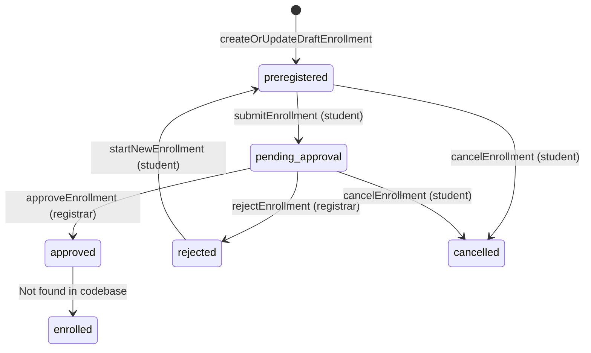
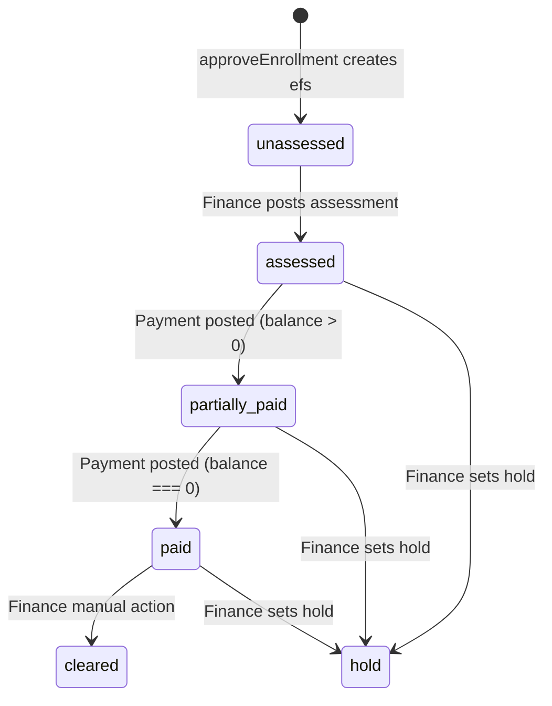
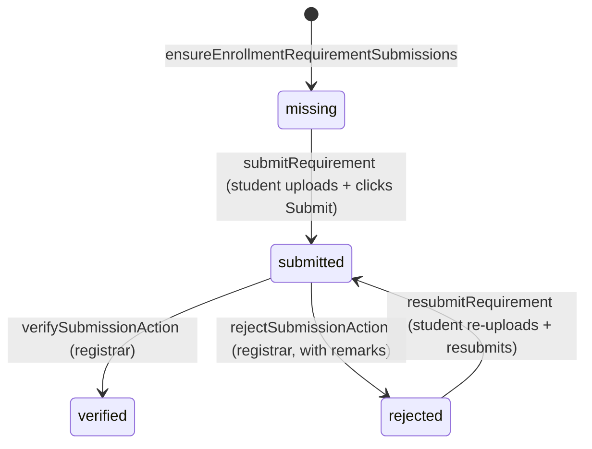
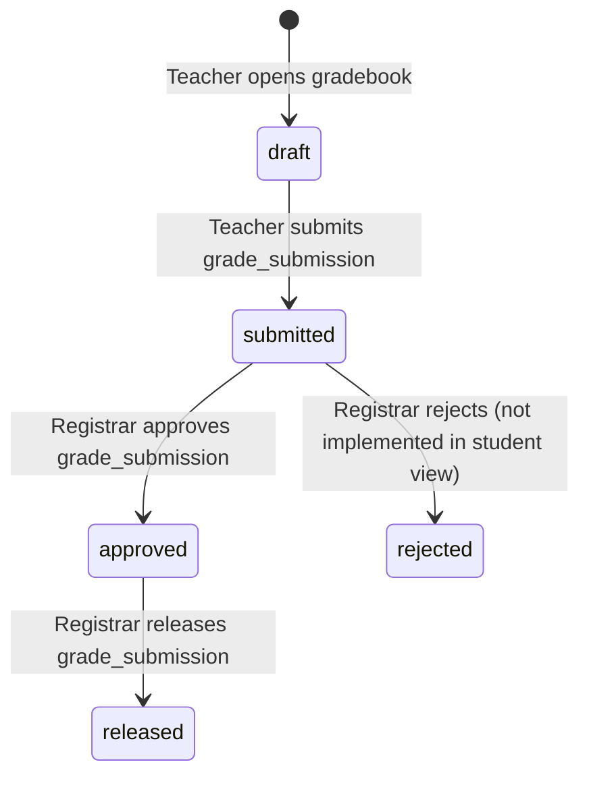

# CORUS Student Flow Audit Report

**Date**: February 16, 2026  
**Scope**: Student role flows only  
**Status**: Current implementation analysis (no code changes)

---

## 1) Student Role Summary

The **Student** role in CORUS represents learners who register accounts, complete demographic profiles, submit enrollment applications, upload required documents, track billing/payment status, view class schedules, and access released grades. The journey begins with minimal account creation (name, email, mobile, password, data privacy consent) via Neon Auth/Better Auth, followed by OTP email verification. After verification, a student record is auto-created with placeholder data, and the user is guided through a 6-step profile wizard collecting personal details, contact, address, guardian, and academic background. Once profile is complete, students can create draft enrollments for the active term, upload documents (PSA Birth Cert, Form 137/138, Good Moral, etc.) which flow through missing → submitted → verified/rejected states. Enrollments transition from preregistered (draft) → pending_approval (submitted) → approved/rejected by the registrar. Upon approval, finance status is initialized and class enrollments are finalized. Students have read-only access to billing (assessments, payments, balance), schedule (after enrollment approval), and grades (only after registrar releases them). Throughout, students interact with registrar (enrollment approval, document verification), finance (assessment creation, payment posting), and teachers (grade submission leading to eventual release).

---

## 2) Step-by-step Current Flow

### **Account Creation & Onboarding**

#### **Step 1: Register Account**
- **Route**: `/register` ([app/(auth)/register/page.tsx](app/(auth)/register/page.tsx))
- **UI**: `RegisterPage` client component with form
- **Fields collected**: fullName, email, contactNo, password, confirmPassword, dataPrivacyConsent (checkbox)
- **Action**: `register` in [app/(auth)/actions.ts](app/(auth)/actions.ts)
  - Validates: all fields required, consent required, passwords match, min 8 chars
  - Calls `auth.signUp.email({ email, password, name: fullName })`
  - Neon Auth creates user in auth system
  - Redirects to `/verify-email?email=...&contactNo=...&consent=true` (passes contactNo + consent via URL params)
- **DB**: No CORUS tables touched yet; only Neon Auth internal tables

#### **Step 2: Email Verification (OTP)**
- **Route**: `/verify-email` ([app/(auth)/verify-email/page.tsx](app/(auth)/verify-email/page.tsx))
- **UI**: `VerifyEmailContent` client component; user receives 6-digit OTP via email
- **Action**: `verifyEmailWithOTP` in [app/(auth)/actions.ts](app/(auth)/actions.ts)
  - Validates: email + 6-digit code required
  - Calls Neon Auth API `${baseUrl}/email-otp/verify-email` with OTP
  - **On success**: Creates `user_profile` row via `createUserProfile` ([db/queries.ts](db/queries.ts) line 78)
    - **DB INSERT**: `user_profile` table with userId (from auth), email, fullName, role='student', contactNo, dataPrivacyConsentAt (timestamp)
  - Redirects to `roleHomePath("student")` = `/student`
- **DB**: `user_profile` table

#### **Step 3: Login (Returning Users)**
- **Route**: `/login` ([app/(auth)/login/page.tsx](app/(auth)/login/page.tsx))
- **Action**: `login` in [app/(auth)/actions.ts](app/(auth)/actions.ts)
  - Calls `auth.signIn.email({ email, password })`
  - Handles special case: if email not verified but user has `emailVerificationBypassed=true` (admin-created accounts), auto-marks emailVerified and retries
  - Gets session, fetches `user_profile` via `getUserProfileByUserId`, redirects to `roleHomePath(role)`
- **Middleware**: [middleware.ts](middleware.ts) checks for session on `/student/*` paths; redirects to `/login` if no session
- **Redirects**: Students go to `/student`

### **Profile Setup**

#### **Step 4: Auto-redirect to Complete Profile**
- **Route**: `/student` → **intercepted by layout** ([app/(portal)/student/(dashboard)/layout.tsx](app/(portal)/student/(dashboard)/layout.tsx))
- **Layout logic**:
  - Calls `getCurrentUserWithStudent()` ([lib/auth/getCurrentStudent.ts](lib/auth/getCurrentStudent.ts))
    - Fetches `user_profile` + `students` via `getProfileAndStudentByUserId` ([db/queries.ts](db/queries.ts) line 100)
  - If `!data?.student` or `!hasStudent` (no id or empty id): **redirect to `/student/complete-profile`**
- **DB READ**: `user_profile`, `students` (joined on userProfileId)

#### **Step 5: Complete Profile Wizard**
- **Route**: `/student/complete-profile` ([app/(portal)/student/complete-profile/page.tsx](app/(portal)/student/complete-profile/page.tsx))
- **Action**: `getProfileInitial` ([app/(portal)/student/complete-profile/actions.ts](app/(portal)/student/complete-profile/actions.ts) line 95)
  - Validates session, fetches `user_profile` + `students`
  - **If student exists with `profileCompletedAt`**: redirect to `/student` (dashboard)
  - **If student exists without `profileCompletedAt`**: return student data for wizard (resume incomplete profile)
  - **If no student**: calls `getOrCreateStudentForUser` ([lib/student/profile.ts](lib/student/profile.ts) line 33)
    - Generates `studentCode` via `generateNextStudentCode()` (format: YYYY-0001)
    - **DB INSERT**: `students` table with userProfileId, studentCode, firstName="—", lastName="—", email (from user_profile)
    - **DB INSERT**: `student_addresses` table with studentId (empty address)
    - Returns placeholder student for wizard
- **UI**: `StudentSetupWizard` ([components/student/setup/StudentSetupWizard.tsx](components/student/setup/StudentSetupWizard.tsx))
  - **6 steps**: Personal Details, Contact Details, Permanent Address, Guardian, Academic Background, Review & Submit
  - Each step auto-saves via `saveStudentProfileStep` (updates `students` or `student_addresses` incrementally)
  - **Step 1 (Personal)**: firstName, middleName, lastName, birthday, sex (Male/Female), gender (Male/Female/Other), religion
    - **DB UPDATE**: `students` table via `updateStudentStep` ([lib/student/profile.ts](lib/student/profile.ts) line 127)
  - **Step 2 (Contact)**: email, mobile
    - **DB UPDATE**: `students.email`, `students.contactNo`
  - **Step 3 (Address)**: addressLine1, barangay, city, province, zip (4-digit)
    - **DB UPDATE**: `student_addresses` via `updateStudentAddress` ([lib/student/profile.ts](lib/student/profile.ts) line 159)
  - **Step 4 (Guardian)**: guardianName, guardianRelationship, guardianMobile
    - **DB UPDATE**: `students` (guardian fields)
  - **Step 5 (Academic)**: studentType (New/Transferee/Returnee), previousSchool, lastGradeCompleted
    - **DB UPDATE**: `students.studentType`, `students.lastSchoolId`, `students.lastSchoolYearCompleted`
  - **Step 6 (Review)**: Displays `ReviewCard` with all collected data; user confirms
    - **Action**: `finalizeStudentProfile` ([app/(portal)/student/complete-profile/actions.ts](app/(portal)/student/complete-profile/actions.ts) line 271)
    - Validates all required fields filled (firstName, lastName, birthday, email, contactNo, address, guardian, studentType)
    - **DB UPDATE**: `students.profileCompletedAt = new Date()`
    - Redirects to `/student` (dashboard)
- **DB**: `students`, `student_addresses`

#### **Alternate Path: /student/setup (Legacy/Minimal)**
- **Route**: `/student/setup` ([app/(portal)/student/setup/page.tsx](app/(portal)/student/setup/page.tsx))
- **UI**: `StudentSetupClient` → `StudentSetupForm` ([app/(portal)/student/setup/StudentSetupForm.tsx](app/(portal)/student/setup/StudentSetupForm.tsx))
- **API**: `/api/student/setup-defaults` ([app/api/student/setup-defaults/route.ts](app/api/student/setup-defaults/route.ts))
  - Returns `{ ok: false, redirect: "student" }` if student already exists
  - Returns `{ ok: true, email, name }` if no student exists
- **Action**: `createStudentFromSetup` ([app/(portal)/student/setup/actions.ts](app/(portal)/student/setup/actions.ts) line 54)
  - Collects: firstName, middleName, lastName, email, contactNo, optional address fields
  - Generates studentCode, inserts student + address
  - **DB INSERT**: `students`, `student_addresses` (no profileCompletedAt set)
  - Redirects to `/student`
- **Status**: Not linked from main flow; appears to be legacy or alternate entry point

### **Enrollment Flow**

#### **Step 6: Access Dashboard**
- **Route**: `/student` ([app/(portal)/student/(dashboard)/page.tsx](app/(portal)/student/(dashboard)/page.tsx))
- **Layout**: [app/(portal)/student/(dashboard)/layout.tsx](app/(portal)/student/(dashboard)/layout.tsx) allows access (student exists, profileCompletedAt set)
- **UI**: Dashboard displays:
  - Enrollment status card (no enrollment vs draft vs pending vs approved)
  - Requirements progress card (X / Y verified)
  - Balance card (₱ amount due)
  - Grades card (released count)
  - Today's classes, announcements, quick actions
- **Data sources**: `getDashboardData` calls:
  - `getEnrollmentForStudentActiveTerm` (active SY + term enrollment)
  - `computeRequirementProgress` (counts verified/required)
  - `getStudentBalance` (efs table)
  - `getAssessmentsByEnrollment`, `getReleasedGradesByStudentAndEnrollment`
  - `getScheduleWithDetailsByEnrollmentId`, `getAnnouncementsForStudent`
- **DB READ**: `enrollments`, `enrollment_finance_status` (efs), `studentRequirementSubmissions`, `requirementFiles`, `gradeEntries`, `gradeSubmissions`, `classSchedules`, `announcements`

#### **Step 7: Create Draft Enrollment**
- **Route**: `/student/enrollment` ([app/(portal)/student/(dashboard)/enrollment/page.tsx](app/(portal)/student/(dashboard)/enrollment/page.tsx))
- **Pre-check**: Calls `getActiveSchoolYear()` + `getActiveTerm()` ([db/queries.ts](db/queries.ts)); if null, displays "No active term" message
- **Pre-check**: Calls `getEnrollmentForStudentActiveTerm(studentId)`; if null, shows `EnrollmentWizard`
- **UI**: `EnrollmentWizard` ([app/(portal)/student/(dashboard)/enrollment/EnrollmentWizard.tsx](app/(portal)/student/(dashboard)/enrollment/EnrollmentWizard.tsx))
  - **Step 1**: Select program (dropdown from `programs` table), yearLevel (1st–5th Year), optional sectionId
  - **Step 2**: Displays planned subjects from curriculum (not implemented in wizard; subjects auto-populated on approval)
  - **Action**: `createOrUpdateDraftEnrollment` ([app/(portal)/student/(dashboard)/enrollment/actions.ts](app/(portal)/student/(dashboard)/enrollment/actions.ts) line 19)
    - Validates programId, yearLevel required
    - If enrollment exists for (studentId, schoolYearId, termId) and status='preregistered': calls `updateDraftEnrollment` ([db/queries.ts](db/queries.ts) line 1475)
    - Else: calls `insertDraftEnrollment` ([db/queries.ts](db/queries.ts) line 1452)
    - **DB INSERT/UPDATE**: `enrollments` table with studentId, schoolYearId, termId, programId, program, yearLevel, sectionId, status='preregistered'
    - Calls `ensureEnrollmentRequirementSubmissions(enrollmentId)` ([lib/requirements/progress.ts](lib/requirements/progress.ts) line 70) to create submission placeholders
    - **DB INSERT**: `student_requirement_submissions` rows (one per applicable requirement) with status='missing'
  - Redirects/refreshes to same page; now displays existing enrollment
- **DB**: `enrollments`, `student_requirement_submissions`

#### **Step 8: View Enrollment Details**
- **Route**: `/student/enrollment` (after draft created)
- **UI**: Displays enrollment card with status badge, program/yearLevel, remarks (if rejected)
- **Status-specific UI**:
  - **preregistered (draft)**: Shows `EnrollmentStatusActions` with "Submit enrollment" button (if policy.canSubmit)
  - **pending_approval**: "Wait for registrar review" message
  - **rejected**: Shows registrar remarks, `NewEnrollmentButton` to reset to draft
  - **approved/enrolled**: "Proceed to billing" link
- **Policy check**: `getEnrollmentRequirementsPolicy` ([lib/requirements/policy.ts](lib/requirements/policy.ts))
  - System settings: `enrollment_requires_verified_requirements`, `enrollment_requires_submitted_requirements`, `enrollment_allow_submit_before_requirements`
  - Returns `canSubmit: boolean`, `message: string` based on requirement statuses
- **DB READ**: `enrollments`, `enrollment_approvals`, `system_settings`, `student_requirement_submissions`

### **Document Submission Flow**

#### **Step 9: Upload Required Documents**
- **Route**: `/student/requirements` ([app/(portal)/student/(dashboard)/requirements/page.tsx](app/(portal)/student/(dashboard)/requirements/page.tsx))
- **Pre-check**: Calls `getEnrollmentForStudentActiveTerm`; if null, shows "No active enrollment" message
- **Data loading**:
  - `ensureEnrollmentRequirementSubmissions(enrollmentId)` ensures submission rows exist
  - `getApplicableRequirements()` ([lib/requirements/getApplicableRequirements.ts](lib/requirements/getApplicableRequirements.ts)) fetches requirements matching:
    - `appliesTo='enrollment'`, program, yearLevel, schoolYearId, termId
    - Falls back to generic enrollment rules if no program-specific rules found
    - Joins `requirement_rules` → `requirements` → `student_requirement_submissions` → `requirement_files`
- **UI**: `StudentRequirementsClient` ([app/(portal)/student/(dashboard)/requirements/StudentRequirementsClient.tsx](app/(portal)/student/(dashboard)/requirements/StudentRequirementsClient.tsx)) renders `RequirementChecklist` ([components/requirements/RequirementChecklist.tsx](components/requirements/RequirementChecklist.tsx))
  - Displays each requirement as `RequirementCard` ([components/requirements/RequirementCard.tsx](components/requirements/RequirementCard.tsx))
  - Card shows: requirement name, description, instructions, status badge (missing/submitted/verified/rejected), file list, upload button
- **Upload flow**:
  1. User selects file → `fetch('/api/uploads/requirements')` POST ([app/api/uploads/requirements/route.ts](app/api/uploads/requirements/route.ts))
     - Validates file type (allowedFileTypes), size (10MB limit), auth
     - Uploads to storage (storageKey: `requirements/${submissionId}/${uuid}.ext`)
     - **DB INSERT**: `requirement_files` table
  2. User clicks "Submit for verification" → `submitRequirement(submissionId)` ([app/(portal)/student/(dashboard)/requirements/actions.ts](app/(portal)/student/(dashboard)/requirements/actions.ts) line 96)
     - Validates: at least one file uploaded
     - **DB UPDATE**: `student_requirement_submissions.status = 'submitted'`, `submittedAt = new Date()`, `markAsToFollow = false`
     - **DB INSERT**: `audit_log` (action='requirement_submit')
  3. If rejected by registrar: status becomes 'rejected', `registrarRemarks` shown
     - User clicks "Resubmit" → `resubmitRequirement(submissionId)` (status back to 'submitted', remarks cleared)
- **Mark as "to follow"**: Checkbox allows student to skip document temporarily (allows enrollment submit without file)
  - Action: `markAsToFollowAction` ([app/(portal)/student/(dashboard)/requirements/actions.ts](app/(portal)/student/(dashboard)/requirements/actions.ts) line 83)
  - **DB UPDATE**: `student_requirement_submissions.markAsToFollow = true`
- **DB**: `requirements`, `requirement_rules`, `student_requirement_submissions`, `requirement_files`, `requirement_requests`

#### **Step 10: Submit Enrollment for Approval**
- **Route**: `/student/enrollment` (on existing draft)
- **UI**: `EnrollmentStatusActions` component with "Submit enrollment" button
- **Pre-check**: `getEnrollmentRequirementsPolicy` determines if submission allowed
  - Policy enforces: `missingRequired.length === 0` (unless marked "to follow") if `requireSubmitted=true`
  - Policy enforces: `unverifiedRequired.length === 0` if `requireVerified=true`
  - If blocked: displays policy.message (e.g., "Submit at least these forms: Birth Certificate, Form 137")
- **Action**: `submitEnrollment(enrollmentId)` ([app/(portal)/student/(dashboard)/enrollment/actions.ts](app/(portal)/student/(dashboard)/enrollment/actions.ts) line 73)
  - Re-validates policy (`getEnrollmentRequirementsPolicy`)
  - Calls `setEnrollmentPendingApproval(enrollmentId)` ([db/queries.ts](db/queries.ts) line 1512)
  - **DB UPDATE**: `enrollments.status = 'pending_approval'`
  - **DB INSERT**: `audit_log` (action='enrollment_submit')
- **Result**: Enrollment card shows "Wait for registrar review" message
- **DB**: `enrollments`, `audit_log`

### **Registrar Approval (Student Perspective)**

#### **Step 11: Wait for Registrar Review**
- **Student action**: None (passive wait)
- **Registrar action**: `/registrar/approvals` → `/registrar/approvals/[enrollmentId]/review` ([app/(portal)/registrar/approvals/[enrollmentId]/review/page.tsx](app/(portal)/registrar/approvals/[enrollmentId]/review/page.tsx))
  - Registrar views enrollment details, student info, requirement submissions with files
  - Can verify/reject each document: `verifySubmissionAction`, `rejectSubmissionAction` ([app/(portal)/registrar/requirements/actions.ts](app/(portal)/registrar/requirements/actions.ts))
    - **DB UPDATE**: `student_requirement_submissions.status = 'verified'` or 'rejected', `verifiedByUserId`, `verifiedAt`, `registrarRemarks`
  - Can request missing documents: `createRequirementRequestAction` ([app/(portal)/registrar/approvals/actions.ts](app/(portal)/registrar/approvals/actions.ts) line 89)
    - **DB INSERT**: `requirement_requests` (status='pending')
  - Approve: `approveEnrollment(enrollmentId)` ([app/(portal)/registrar/approvals/actions.ts](app/(portal)/registrar/approvals/actions.ts) line 19)
    - Validates: all required documents verified (unless override=true with remarks)
    - Calls `approveEnrollmentById` ([db/queries.ts](db/queries.ts) line 1334)
    - **DB UPDATE**: `enrollments.status = 'approved'`
    - **DB INSERT/UPDATE**: `enrollment_approvals` (status='approved', reviewedByUserId, reviewedAt, remarks)
    - **DB INSERT**: `enrollment_finance_status` (efs) with enrollmentId, status='unassessed', balance=0 (if not exists)
    - Calls `finalizeEnrollmentClasses(enrollmentId)` ([lib/enrollment/finalizeEnrollmentClasses.ts](lib/enrollment/finalizeEnrollmentClasses.ts) line 27)
      - **Scenario A (section has schedules)**: Creates `class_offerings` per schedule, inserts `student_class_enrollments`, inserts `enrollment_subjects` snapshot
      - **Scenario B (no section schedules yet)**: Inserts `enrollment_subjects` from curriculum
    - **DB INSERT**: `student_class_enrollments`, `enrollment_subjects`, `class_offerings`
  - Reject: `rejectEnrollment(enrollmentId, remarks)` ([app/(portal)/registrar/approvals/actions.ts](app/(portal)/registrar/approvals/actions.ts) line 68)
    - **DB UPDATE**: `enrollments.status = 'rejected'`, `enrollment_approvals.status = 'rejected'`, `enrollment_approvals.remarks`
- **Student visibility**: `/student/enrollment` page updates with new status badge; rejected shows remarks + "Start new enrollment" button
- **DB**: `enrollments`, `enrollment_approvals`, `enrollment_finance_status`, `student_class_enrollments`, `enrollment_subjects`, `class_offerings`

#### **Step 12: Rejected Enrollment (Student Recovery)**
- **Route**: `/student/enrollment` (status='rejected')
- **UI**: Shows red alert with registrar remarks, `NewEnrollmentButton`
- **Action**: `startNewEnrollment(enrollmentId)` ([app/(portal)/student/(dashboard)/enrollment/actions.ts](app/(portal)/student/(dashboard)/enrollment/actions.ts) line 147)
  - Validates enrollment.status === 'rejected'
  - Calls `resetRejectedEnrollmentToDraft(enrollmentId)` ([db/queries.ts](db/queries.ts) line 1537)
  - **DB UPDATE**: `enrollments.status = 'preregistered'` (back to draft)
  - Student can edit draft, upload/fix documents, resubmit
- **DB**: `enrollments`

### **Finance & Billing Flow**

#### **Step 13: Finance Assessment (Registrar/Finance Action)**
- **Registrar/Finance route**: `/registrar/enrollments` or `/finance/assessments`
- **Finance action**: Create assessment via finance portal (not documented in student audit scope)
  - **DB INSERT**: `assessments` table with enrollmentId, status='draft'
  - **DB INSERT**: `assessment_lines` (tuition, lab, misc fees)
  - Finance posts assessment: status='posted'
  - **DB UPDATE**: `assessments.status = 'posted'`, `assessments.postedByUserId`, `assessments.postedAt`
  - Triggers recompute of efs: `recomputeEnrollmentBalance(enrollmentId)` ([lib/finance/recomputeEnrollmentBalance.ts](lib/finance/recomputeEnrollmentBalance.ts))
    - **DB UPDATE**: `enrollment_finance_status.status` (based on balance): 'assessed' (if balance > 0), 'paid' (if balance === 0), etc.
    - **DB UPDATE**: `enrollment_finance_status.balance` (calculated from assessment - payments)
- **DB**: `assessments`, `assessment_lines`, `enrollment_finance_status`

#### **Step 14: View Billing**
- **Route**: `/student/billing` ([app/(portal)/student/(dashboard)/billing/page.tsx](app/(portal)/student/(dashboard)/billing/page.tsx))
- **Pre-check**: If enrollment.status is approved/enrolled, checks `getEnrolledStudentMissingRequiredFormNames` ([lib/requirements/progress.ts](lib/requirements/progress.ts) line 83); if missing forms, redirects to `/student/requirements?required=1`
- **Data loading**:
  - `getStudentBalance(enrollmentId)` ([lib/finance/queries.ts](lib/finance/queries.ts)) → efs row
  - `getAssessmentsByEnrollment(enrollmentId)` → assessments
  - `getPaymentsByEnrollment(enrollmentId)` → payments (posted by Finance)
  - `hasActiveFinanceHoldForEnrollment(enrollmentId)` → governance_flags check
- **UI**: Displays:
  - Finance status badge (efs.status: unassessed/assessed/paid/cleared/hold)
  - Total assessed (from posted assessment), Total paid (sum of payments), Balance due (efs.balance)
  - Payment history table (read-only)
  - Link to `/student/billing/[assessmentId]/form` (assessment breakdown PDF-like view)
- **Student actions**: None (read-only); Finance posts payments via finance portal
- **DB READ**: `enrollment_finance_status`, `assessments`, `payments`, `governance_flags`

### **Schedule & Grades Flow**

#### **Step 15: View Schedule**
- **Route**: `/student/schedule` ([app/(portal)/student/(dashboard)/schedule/page.tsx](app/(portal)/student/(dashboard)/schedule/page.tsx))
- **Pre-check**: Enrollment must be approved/enrolled; if not, shows "Schedule will be available after approval" message
- **Pre-check**: If enrolled, checks `getEnrolledStudentMissingRequiredFormNames`; redirects to requirements if missing
- **Data loading**:
  - `getScheduleFromClassEnrollmentsByEnrollmentId(enrollmentId)` ([db/queries.ts](db/queries.ts)) → student_class_enrollments joined to class_schedules
  - Fallback: `getEnrollmentSubjectsByEnrollmentId` → enrollment_subjects (planned subjects before schedule finalized)
  - Fallback: `getScheduleWithDetailsByEnrollmentId` → legacy view
- **UI**: Displays schedule by day (Mon–Sat) with subject code, time, room, section name
  - If only `enrollment_subjects` exist (no schedules yet): displays "Planned subjects" list
- **DB READ**: `student_class_enrollments`, `class_schedules`, `enrollment_subjects`, `class_offerings`, `subjects`

#### **Step 16: View Grades**
- **Route**: `/student/grades` ([app/(portal)/student/(dashboard)/grades/page.tsx](app/(portal)/student/(dashboard)/grades/page.tsx))
- **Pre-check**: Same as schedule (approved/enrolled + no missing required forms)
- **Data loading**: `getReleasedGradesByStudentAndEnrollment(studentId, enrollmentId)` ([db/queries.ts](db/queries.ts) line 3387)
  - Filters: `gradeSubmissions.status = 'released'` (teacher submitted → registrar approved → registrar released)
  - Joins: `grade_entries` → `grade_submissions` → `grading_periods` → `class_schedules` → `subjects`
- **UI**: Table with columns: Subject, Description, Period, Grade (numeric), Letter, Remarks
  - If no grades: "Grades not released yet"
- **Teacher flow (background)**: `/teacher/gradebook/[scheduleId]/[periodId]` → submits grade_entries → creates grade_submission with status='submitted'
- **Registrar flow (background)**: `/registrar/grades` → approves grade_submission (status='approved') → releases (status='released')
- **DB READ**: `grade_entries`, `grade_submissions` (where status='released'), `grading_periods`, `class_schedules`, `subjects`

### **Profile & Announcements**

#### **Step 17: View Profile**
- **Route**: `/student/profile` ([app/(portal)/student/(dashboard)/profile/page.tsx](app/(portal)/student/(dashboard)/profile/page.tsx))
- **Data loading**: `getMyStudentProfile(studentId)` ([db/queries.ts](db/queries.ts) line 589) → full student + address + program details
- **UI**: `ProfileHeader`, `IdentityCard` (shows 2x2 photo if uploaded), `DetailsCard` (personal, contact, address, guardian, academic)
- **DB READ**: `students`, `student_addresses`, `programs`

#### **Step 18: View Announcements**
- **Route**: `/student/announcements` ([app/(portal)/student/(dashboard)/announcements/page.tsx](app/(portal)/student/(dashboard)/announcements/page.tsx))
- **Data loading**: `getAnnouncementsForStudent(limit, program)` ([db/queries.ts](db/queries.ts))
  - Filters: `audience='all'` OR `audience='students'` AND (program matches OR program is null)
  - Orders by pinned DESC, createdAt DESC
- **UI**: List of announcement cards with title, body, pinned badge, creator role badge
- **DB READ**: `announcements`

---

## 3) State Machine (Status Transitions)

### **Enrollment Status Transitions**

- **Table**: `enrollments.status` (enum: preregistered, pending_approval, pending, approved, rejected, enrolled, cancelled)
- **Key transitions**:
  - `preregistered` → `pending_approval`: Student clicks "Submit enrollment" (if policy.canSubmit)
  - `pending_approval` → `approved`: Registrar approves via `/registrar/approvals/[enrollmentId]/review`
  - `pending_approval` → `rejected`: Registrar rejects with remarks
  - `rejected` → `preregistered`: Student clicks "Start new enrollment" (resets to draft)
  - `approved` → `enrolled`: **Not found in codebase** (no transition logic; both statuses treated as "enrolled" in UI)
- **Side effects on approve**:
  - `enrollment_approvals` row inserted/updated
  - `enrollment_finance_status` (efs) row created if not exists (status='unassessed')
  - `finalizeEnrollmentClasses` runs (creates class enrollments, populates enrollment_subjects)

### **Finance Status Transitions**

- **Table**: `enrollment_finance_status` (efs) with `status` (enum: unassessed, assessed, partially_paid, paid, cleared, hold)
- **Key transitions**:
  - Created when enrollment approved (initial status='unassessed', balance=0)
  - `unassessed` → `assessed`: Finance posts assessment (balance computed from assessment lines)
  - `assessed` → `partially_paid` → `paid`: As Finance posts payments; `recomputeEnrollmentBalance` updates balance + status
  - `paid` → `cleared`: Finance manually marks cleared (not automatic)
  - Any status → `hold`: Finance sets governance flag (flagType='finance_hold')
- **Student visibility**: Read-only on `/student/billing`

### **Document Submission Status Transitions**

- **Table**: `student_requirement_submissions.status` (enum: missing, submitted, verified, rejected)
- **Key transitions**:
  - `missing` → `submitted`: Student uploads file(s) + clicks "Submit for verification"
  - `submitted` → `verified`: Registrar clicks "Verify" on `/registrar/requirements/queue` or review page
  - `submitted` → `rejected`: Registrar clicks "Reject" with `registrarRemarks`
  - `rejected` → `submitted`: Student fixes + clicks "Resubmit"
- **Special state**: `markAsToFollow=true` allows enrollment submit without file; submission stays 'missing' but doesn't block

### **Grade Release Status Transitions**

- **Table**: `grade_submissions.status` (enum: draft, submitted, approved, released, rejected)
- **Key transitions**:
  - `draft`: Teacher enters grades in `/teacher/gradebook/[scheduleId]/[periodId]`
  - `draft` → `submitted`: Teacher clicks "Submit grades"
  - `submitted` → `approved`: Registrar approves in `/registrar/grades`
  - `approved` → `released`: Registrar releases (makes visible to students)
- **Student visibility**: Only grades with `grade_submissions.status = 'released'` appear on `/student/grades`

---

## 4) Touchpoints (Student Interacts With...)

### **Registrar**

| Action | Student Trigger | Registrar Response | Location |
|--------|----------------|-------------------|----------|
| **Enrollment approval** | Student submits enrollment (status=pending_approval) | Registrar approves/rejects via `/registrar/approvals/[enrollmentId]/review` | [app/(portal)/registrar/approvals/actions.ts](app/(portal)/registrar/approvals/actions.ts) |
| **Document verification** | Student uploads + submits requirement (status=submitted) | Registrar verifies/rejects via `/registrar/requirements/queue` or review page | [app/(portal)/registrar/requirements/actions.ts](app/(portal)/registrar/requirements/actions.ts) |
| **Document request** | Student marks "to follow" or misses document | Registrar requests document via review page; student sees pending request on `/student/requirements` | [app/(portal)/registrar/approvals/actions.ts](app/(portal)/registrar/approvals/actions.ts) line 89 |
| **Grade release** | Student waits for grades | Registrar releases grades (after teacher submit → registrar approve) via `/registrar/grades` | [db/queries.ts](db/queries.ts) line 3378 |
| **Section assignment** | Enrollment approved without section | Registrar assigns section via `/registrar/enrollments`; triggers `finalizeEnrollmentClasses` | [app/(portal)/registrar/enrollments/actions.ts](app/(portal)/registrar/enrollments/actions.ts) line 76 |

### **Finance**

| Action | Student Trigger | Finance Response | Location |
|--------|----------------|------------------|----------|
| **Fee assessment** | Enrollment approved (efs created with status=unassessed) | Finance creates + posts assessment via `/finance/assessments` | efs status → assessed; Not documented in student files |
| **Payment posting** | Student pays outside system (bank, cashier) | Finance posts payment via `/finance/payments`; balance updated | [lib/finance/recomputeEnrollmentBalance.ts](lib/finance/recomputeEnrollmentBalance.ts) |
| **Finance clearance** | Student balance paid (efs.status=paid) | Finance marks cleared via `/finance/clearance` | efs status → cleared |
| **Account hold** | Student has unpaid balance or other issue | Finance sets governance flag (finance_hold) | Displayed on `/student/billing` as amber alert |

### **Teacher**

| Action | Student Trigger | Teacher Response | Location |
|--------|----------------|------------------|----------|
| **Grade submission** | Student enrolled in class (student_class_enrollments) | Teacher submits grades via `/teacher/gradebook/[scheduleId]/[periodId]` | grade_submission status → submitted |
| **Grade updates** | Student sees no grades yet | Teacher edits draft, registrar approves + releases | Only 'released' grades visible on `/student/grades` |

---

## 5) Friction & Bugs (Confusing or Error-prone)

### **Critical Issues**

1. **Two onboarding paths with no clear routing**
   - **Problem**: `/student/setup` (StudentSetupForm) and `/student/complete-profile` (StudentSetupWizard) both create students; setup is not linked from main flow
   - **Impact**: setup page creates student WITHOUT `profileCompletedAt`, bypassing validation; complete-profile has full wizard
   - **Evidence**: [app/(portal)/student/setup/actions.ts](app/(portal)/student/setup/actions.ts) line 54 (`createStudentFromSetup`) vs [app/(portal)/student/complete-profile/actions.ts](app/(portal)/student/complete-profile/actions.ts) line 271 (`finalizeStudentProfile`)
   - **Risk**: Data inconsistency; students created via setup skip required fields (birthday, sex, religion, guardian)

2. **No profile completeness gate before enrollment**
   - **Problem**: Student can create enrollment even if profile missing critical fields (sex, guardian, birthday)
   - **Current**: `finalizeStudentProfile` validates fields but enrollment creation (`insertDraftEnrollment`) does NOT check `profileCompletedAt`
   - **Impact**: Enrollment with incomplete student data reaches registrar review
   - **Evidence**: [app/(portal)/student/(dashboard)/enrollment/actions.ts](app/(portal)/student/(dashboard)/enrollment/actions.ts) line 19; no check for `profileCompletedAt`

3. **Unclear "approved" vs "enrolled" status**
   - **Problem**: `enrollments.status` enum has both 'approved' and 'enrolled'; no transition logic from approved → enrolled found in codebase
   - **Impact**: Both statuses treated identically in UI (`isApproved = status === "approved" || status === "enrolled"`); unclear when/why status becomes 'enrolled'
   - **Evidence**: [app/(portal)/student/(dashboard)/billing/page.tsx](app/(portal)/student/(dashboard)/billing/page.tsx) line 40, [db/schema.ts](db/schema.ts) line 731

4. **Missing required forms block schedule/billing/grades silently**
   - **Problem**: If enrolled student has missing required forms (marked "to follow" during submit), they're redirected from `/student/schedule`, `/student/billing`, `/student/grades` to `/student/requirements?required=1`
   - **Impact**: Confusing UX; user doesn't understand why they can't see schedule
   - **Evidence**: [app/(portal)/student/(dashboard)/schedule/page.tsx](app/(portal)/student/(dashboard)/schedule/page.tsx) line 52, [app/(portal)/student/(dashboard)/billing/page.tsx](app/(portal)/student/(dashboard)/billing/page.tsx) line 43

5. **No notifications or toasts for state changes**
   - **Problem**: When registrar approves enrollment, rejects document, or finance posts payment, student only sees status change by refreshing pages; no proactive notification
   - **Impact**: Student must manually check each page for updates
   - **Evidence**: No notification system found in codebase

### **Minor Friction**

6. **Document upload requires two clicks**
   - **Flow**: Upload file → refresh → click "Submit for verification"
   - **Better UX**: Auto-submit after upload, or "Upload & Submit" single action

7. **No "profile completeness meter" on dashboard**
   - **Problem**: Student doesn't see % of profile filled or what's missing
   - **Impact**: User may not realize profile is incomplete until enrollment blocked
   - **Suggestion**: Add widget showing "Profile 85% complete • Missing: Birthday, Guardian mobile"

8. **ZIP code validation not enforced at DB level**
   - **Problem**: `student_addresses.zipCode` is varchar(16); wizard validates `/^\d{4}$/` but DB allows any string
   - **Impact**: Inconsistent data if student bypasses UI validation
   - **Evidence**: [db/schema.ts](db/schema.ts) line 1345, [app/(portal)/student/complete-profile/actions.ts](app/(portal)/student/complete-profile/actions.ts) line 36

9. **Enrollment cannot be edited after submit**
   - **Problem**: If student submits enrollment with wrong program/yearLevel, they can only cancel (if pending) or wait for rejection
   - **Impact**: No self-service correction for mistakes
   - **Evidence**: `createOrUpdateDraftEnrollment` checks `existing.status !== "preregistered"` and returns error ([app/(portal)/student/(dashboard)/enrollment/actions.ts](app/(portal)/student/(dashboard)/enrollment/actions.ts) line 42)

10. **No bulk document upload**
    - **Problem**: Student must upload each document one-by-one (Birth Cert, Form 137, Form 138, Good Moral, 2x2 photo, etc.)
    - **Impact**: Tedious for freshmen with 5+ documents
    - **Suggestion**: Drag-drop multi-file upload with smart auto-matching by filename

11. **No email/SMS notification for approval/rejection**
    - **Problem**: Student must manually check portal for enrollment status updates
    - **Impact**: Delayed awareness of approval/rejection

12. **"Mark as to follow" checkbox is unclear**
    - **Problem**: Label says "Submit later" but doesn't explain impact (allows enrollment submit without file, but may block schedule/billing later)
    - **Evidence**: [components/requirements/RequirementCard.tsx](components/requirements/RequirementCard.tsx)

### **Bugs / Data Issues**

13. **Duplicate student address types not implemented**
    - **Schema change**: `student_addresses.addressType` and `sameAsPermanent` added to schema ([db/schema.ts](db/schema.ts) line 1348) but not used in wizard
    - **Impact**: New enum + columns exist but UI still treats student_addresses as single permanent address
    - **Evidence**: [components/student/setup/StudentSetupWizard.tsx](components/student/setup/StudentSetupWizard.tsx) has `sameAsMailing`, `mailingAddressLine1` in WizardState (lines 71-137) but no UI fields rendered

14. **New schema fields not surfaced in UI**
    - **Problem**: Recent schema additions (suffix, placeOfBirth, citizenship, civilStatus, lrn, alternateContact, shsStrand, guardianConsentAt) are in [db/schema.ts](db/schema.ts) (lines 178-197) but wizard only partially updated
    - **Impact**: Student cannot provide these fields; columns remain null
    - **Evidence**: [components/student/setup/StudentSetupWizard.tsx](components/student/setup/StudentSetupWizard.tsx) types include new fields but step rendering (lines 344+) only shows partial implementation (suffix select added at line 419 but not rendered)

15. **Pending student applications not linked**
    - **Function**: `submitPendingApplication` ([app/actions/pendingStudents.ts](app/actions/pendingStudents.ts) line 29) creates `pending_student_applications` row
    - **Problem**: No UI form found; `/student/pending-approval` just redirects to complete-profile
    - **Impact**: Dead code or incomplete feature; registrar has `/registrar/pending` page to approve pending apps, but no student-facing form

16. **student_emergency_contacts + student_previous_schools tables not used**
    - **Schema**: New tables created ([db/schema.ts](db/schema.ts) lines 1348-1375) but no queries, actions, or UI components reference them
    - **Impact**: Tables exist but data never inserted/displayed

---

## 6) Improvements (Prioritized)

### **Quick Wins (1-2 days)**

#### **QW1: Remove or hide /student/setup (conflicting onboarding path)**
- **Why**: Two paths confuse flow; setup bypasses validation
- **Action**: Deprecate `/student/setup` route; redirect to `/student/complete-profile`
- **Benefit**: Single onboarding path with consistent validation

#### **QW2: Add profile completeness gate before enrollment creation**
- **Why**: Prevent incomplete profiles from reaching registrar
- **Action**: In `createOrUpdateDraftEnrollment`, check `students.profileCompletedAt IS NOT NULL` and `finalizeStudentProfile` validation before allowing enrollment
- **Benefit**: Registrar sees only complete student data

#### **QW3: Add "Profile completeness" widget on dashboard**
- **Why**: Student doesn't know what's missing
- **Action**: Compute `requiredFields` (firstName, lastName, birthday, sex, religion, address, guardian, studentType) vs `filledFields`; show % + missing list on `/student` dashboard
- **Benefit**: Proactive guidance; reduce incomplete enrollments

#### **QW4: Clarify "Mark as to follow" checkbox with tooltip**
- **Why**: Students don't understand impact (can submit enrollment but may block schedule/grades later)
- **Action**: Add tooltip/helper text: "Check this if you'll submit this document later. You can submit your enrollment, but you must upload this form before accessing Schedule and Grades."
- **Benefit**: Informed decisions; fewer confused students

#### **QW5: Add success toasts for key actions**
- **Why**: No feedback after upload, submit, save
- **Action**: Add toast notifications for: file uploaded, requirement submitted, enrollment saved, enrollment submitted
- **Benefit**: Immediate confirmation; better UX

#### **QW6: Make enrollment status descriptions more actionable**
- **Why**: "Wait for registrar review" is passive
- **Action**: Add estimated timeline ("usually 1-3 business days") + next steps ("While waiting, you can add/update documents on Requirements page")
- **Benefit**: Reduces uncertainty; keeps students engaged

### **Medium Complexity (1-2 weeks)**

#### **M1: Implement emergency contact + previous schools tables**
- **Why**: Schema tables exist but unused; PH colleges need this data
- **Action**: 
  - Add Step 5 "Emergency Contact" in wizard (between Address and Guardian)
  - Add Step 7 "Previous Schools" (structured list with level, schoolName, yearsAttended, yearGraduated, strand for SHS)
  - Create queries: `insertEmergencyContact`, `insertPreviousSchool`, `getEmergencyContactByStudentId`, `getPreviousSchoolsByStudentId`
  - Update `StudentDraft` type to include emergency + previousSchools arrays
- **Benefit**: Collect full PH Student Information Sheet data

#### **M2: Implement mailing address (separate from permanent)**
- **Why**: `student_addresses.addressType` enum exists but unused
- **Action**:
  - Add Step 4 "Mailing Address" in wizard with `sameAsPermanent` checkbox
  - If unchecked, collect mailing fields; insert two rows in `student_addresses` (one permanent, one mailing)
  - Update `getOrCreateStudentForUser` to return both addresses
- **Benefit**: Accurate correspondence address for students living away from home

#### **M3: Implement email/SMS notifications for key events**
- **Why**: Students miss status updates
- **Action**:
  - Integrate notification service (e.g., Resend for email, Twilio for SMS)
  - Trigger on: enrollment approved/rejected, document verified/rejected, assessment posted, grade released
  - Store notification preferences in `user_profile.notificationPreferences` (jsonb)
- **Benefit**: Proactive updates; reduce support queries

#### **M4: Add "Edit enrollment" for draft status only**
- **Why**: Student can't fix mistakes before submit
- **Action**: On `/student/enrollment` when status='preregistered', show "Edit" button → inline form to change program/yearLevel/section
- **Benefit**: Self-service error correction

#### **M5: Implement bulk document upload with smart matching**
- **Why**: Tedious to upload 5+ documents one-by-one
- **Action**:
  - Add "Upload multiple files" button on `/student/requirements`
  - After upload, detect document types by filename (e.g., "Form_137.pdf" → Form 137, "BirthCert.jpg" → Birth Certificate)
  - Show mapping UI: "We detected these documents: [list]. Confirm or adjust."
  - Batch submit all
- **Benefit**: Faster onboarding for freshmen

#### **M6: Add single "Enrollment Timeline" view**
- **Why**: Student must navigate between /enrollment, /requirements, /billing, /grades to understand status
- **Action**: Create `/student/enrollment/timeline` with vertical stepper:
  1. Profile complete ✓
  2. Draft enrollment saved ✓
  3. Documents uploaded (3 / 5 verified)
  4. Enrollment submitted ✓ (pending registrar)
  5. Registrar approved ⏳ (waiting)
  6. Finance assessed (unassessed)
  7. Payment complete (balance: ₱15,000)
  8. Enrolled (cleared)
- **Benefit**: One-page overview; reduces navigation; clear next action

#### **M7: Add "What's next?" actionable card on dashboard**
- **Why**: Student doesn't know what to do after each step
- **Action**: Display dynamic card based on state:
  - Profile incomplete: "Complete your profile (85% done) →"
  - No enrollment: "Start enrollment for 2025-2026 1st Sem →"
  - Draft enrollment: "Submit your enrollment (3 / 5 documents verified) →"
  - Pending approval: "Wait for registrar (usually 1-3 days)"
  - Approved, unassessed: "Finance is preparing your assessment"
  - Assessed, balance due: "Pay ₱15,000 to complete enrollment →"
  - Cleared: "You're enrolled! View your schedule →"
- **Benefit**: Guided experience; reduce confusion

### **Structural (Requires Schema Changes)**

#### **S1: Normalize address storage (permanent vs mailing)**
- **Why**: Current `student_addresses` mixes concepts; `addressType` enum added but logic not implemented
- **Action**:
  - Migrate existing `student_addresses` rows to addressType='permanent'
  - Update `getOrCreateStudentForUser`, `updateStudentAddress` to handle addressType parameter
  - Update wizard to insert/update both address types
- **Benefit**: Proper separation; accurate mailing addresses

#### **S2: Add student_type to enrollments table**
- **Why**: `students.studentType` is profile-level (New/Transferee/Returnee) but should be enrollment-level (student may transfer in one term, be "old" in next)
- **Action**:
  - Add `enrollments.studentType` (varchar 32)
  - Migrate existing enrollments: copy from `students.studentType`
  - Update `createOrUpdateDraftEnrollment` to collect studentType
  - Update `requirement_rules` matching logic to use `enrollments.studentType` instead of `students.studentType`
- **Benefit**: Accurate requirement scoping per enrollment (e.g., Honorable Dismissal only for transferees)

#### **S3: Merge enrollment_approvals into enrollments**
- **Why**: `enrollment_approvals` is 1:1 with enrollments; redundant join
- **Action**:
  - Add `enrollments.reviewedByUserId`, `enrollments.reviewedAt`, `enrollments.approvalRemarks` columns
  - Migrate data from `enrollment_approvals`
  - Deprecate `enrollment_approvals` table
  - Update `approveEnrollmentById`, `rejectEnrollmentById` to write directly to enrollments
- **Benefit**: Simpler schema; one less join; faster queries

#### **S4: Add enrollments.submittedAt timestamp**
- **Why**: No record of when student clicked "Submit enrollment"
- **Action**: Add `enrollments.submittedAt` (timestamp); set in `setEnrollmentPendingApproval`
- **Benefit**: Audit trail; registrar can see wait time (submittedAt → reviewedAt)

#### **S5: Separate guardian from emergency contact (already in schema, needs implementation)**
- **Why**: Philippine schools distinguish between guardian (legal) and emergency contact (who to call)
- **Action**:
  - Implement `student_emergency_contacts` table (already created in schema [db/schema.ts](db/schema.ts) line 1348)
  - Add wizard step between Address and Guardian for emergency contact
  - Add queries: `insertEmergencyContact`, `getEmergencyContactByStudentId`
  - Update ReviewCard to display both
- **Benefit**: Proper data model; aligns with PH Student Info Sheet

#### **S6: Implement structured previous schools (already in schema, needs implementation)**
- **Why**: `students.lastSchoolId` + `lastSchoolYearCompleted` are strings; should be relational with level (JHS/SHS/College), schoolName, address, yearGraduated, strand (SHS)
- **Action**:
  - Implement `student_previous_schools` table (already created [db/schema.ts](db/schema.ts) line 1360)
  - Add wizard step for previous schools with "+ Add school" button (collects level, schoolName, schoolAddress, yearsAttended, yearGraduated, strand for SHS)
  - Migrate existing `lastSchoolId` → `student_previous_schools` row
  - Deprecate `students.lastSchoolId`, `students.lastSchoolYearCompleted`
- **Benefit**: Richer academic history; enables analytics (e.g., "How many SHS STEM students enroll in BSIT?")

#### **S7: Add consent tracking table**
- **Why**: Data Privacy Act requires explicit consent records with timestamp, purpose, version
- **Action**:
  - Create `student_consents` table (studentId, consentType enum [data_privacy, guardian, photo_release], version, consentedAt, ipAddress)
  - Store dataPrivacyConsentAt in consents table instead of `user_profile`
  - Add "View my consents" link on profile page
- **Benefit**: Audit-proof compliance; revoke/renew consent support

---

## 7) Implementation Map

### **Quick Wins**

| ID | Improvement | Files to Change | Description |
|----|-------------|----------------|-------------|
| QW1 | Remove /student/setup | [app/(portal)/student/setup/page.tsx](app/(portal)/student/setup/page.tsx), [app/(portal)/student/setup/StudentSetupClient.tsx](app/(portal)/student/setup/StudentSetupClient.tsx), [app/(portal)/student/setup/actions.ts](app/(portal)/student/setup/actions.ts), [app/api/student/setup-defaults/route.ts](app/api/student/setup-defaults/route.ts) | Delete files or add redirect: `redirect("/student/complete-profile")` |
| QW2 | Profile completeness gate | [app/(portal)/student/(dashboard)/enrollment/actions.ts](app/(portal)/student/(dashboard)/enrollment/actions.ts) line 19 | In `createOrUpdateDraftEnrollment`, add check: `if (!profile.student.profileCompletedAt) return { error: "Complete your profile first" }` |
| QW3 | Profile completeness widget | [app/(portal)/student/(dashboard)/page.tsx](app/(portal)/student/(dashboard)/page.tsx) | Add `computeProfileCompleteness(student)` function; display card with progress bar + missing fields list |
| QW4 | Clarify "Mark as to follow" | [components/requirements/RequirementCard.tsx](components/requirements/RequirementCard.tsx) | Add tooltip or helper text below checkbox: "You can submit enrollment without this file, but must upload it later to access Schedule and Grades." |
| QW5 | Add success toasts | [app/(portal)/student/(dashboard)/requirements/StudentRequirementsClient.tsx](app/(portal)/student/(dashboard)/requirements/StudentRequirementsClient.tsx), [app/(portal)/student/(dashboard)/enrollment/EnrollmentWizard.tsx](app/(portal)/student/(dashboard)/enrollment/EnrollmentWizard.tsx) | Install `sonner` or use shadcn toast; call `toast.success("File uploaded")` after actions |
| QW6 | Actionable enrollment status | [app/(portal)/student/(dashboard)/enrollment/page.tsx](app/(portal)/student/(dashboard)/enrollment/page.tsx) lines 113-135 | Replace static messages with: "Your enrollment is pending registrar review (usually 1-3 business days). While waiting, you can [add/update documents on Requirements page →]" |

### **Medium Complexity**

| ID | Improvement | Files to Change | Description |
|----|-------------|----------------|-------------|
| M1 | Emergency contact + previous schools | [components/student/setup/StudentSetupWizard.tsx](components/student/setup/StudentSetupWizard.tsx), [app/(portal)/student/complete-profile/actions.ts](app/(portal)/student/complete-profile/actions.ts), [db/queries.ts](db/queries.ts) | Add Step 5 "Emergency Contact" (name, relationship, mobile) + Step 7 "Previous Schools" (list with level, schoolName, address, years, graduated, strand). Create queries: `insertEmergencyContact`, `insertPreviousSchool`, `getEmergencyContactByStudentId`, `getPreviousSchoolsByStudentId`. Update wizard state + validation. |
| M2 | Mailing address | [components/student/setup/StudentSetupWizard.tsx](components/student/setup/StudentSetupWizard.tsx), [lib/student/profile.ts](lib/student/profile.ts), [app/(portal)/student/complete-profile/actions.ts](app/(portal)/student/complete-profile/actions.ts) | Add Step 4 "Mailing Address" after Permanent Address. Add `sameAsPermanent` checkbox; if false, collect mailing fields. Insert second `student_addresses` row with addressType='mailing'. Update `getOrCreateStudentForUser` to return both addresses. |
| M3 | Email/SMS notifications | New: `lib/notifications/send.ts`, [app/(portal)/registrar/approvals/actions.ts](app/(portal)/registrar/approvals/actions.ts), [app/(portal)/registrar/requirements/actions.ts](app/(portal)/registrar/requirements/actions.ts), [lib/finance/recomputeEnrollmentBalance.ts](lib/finance/recomputeEnrollmentBalance.ts) | Integrate Resend (email) or Twilio (SMS). Add `sendNotification(userId, event, data)` helper. Trigger in: `approveEnrollmentById`, `rejectEnrollmentById`, `verifySubmissionAction`, `rejectSubmissionAction`, assessment post, grade release. Store preference in `user_profile.notificationPreferences`. |
| M4 | Edit enrollment (draft) | [app/(portal)/student/(dashboard)/enrollment/page.tsx](app/(portal)/student/(dashboard)/enrollment/page.tsx), [app/(portal)/student/(dashboard)/enrollment/EnrollmentWizard.tsx](app/(portal)/student/(dashboard)/enrollment/EnrollmentWizard.tsx) | When status='preregistered', pre-fill EnrollmentWizard with existing data; allow edit; save calls `updateDraftEnrollment`. Add "Edit enrollment" button on enrollment card. |
| M5 | Bulk document upload | [app/(portal)/student/(dashboard)/requirements/StudentRequirementsClient.tsx](app/(portal)/student/(dashboard)/requirements/StudentRequirementsClient.tsx), [app/api/uploads/requirements/route.ts](app/api/uploads/requirements/route.ts) | Add "Upload multiple files" button. Use drag-drop library (react-dropzone). Parse filenames (`/birth.*cert|form.*137|form.*138/i`). Show mapping UI: "We matched these files [list]; adjust if needed." Batch insert `requirement_files` + update statuses to 'submitted'. |
| M6 | Enrollment timeline view | New: [app/(portal)/student/(dashboard)/enrollment/timeline/page.tsx](app/(portal)/student/(dashboard)/enrollment/timeline/page.tsx) | Create vertical stepper component. Fetch enrollment + requirements + efs + assessments + payments. Display 8-step progress: Profile → Draft → Documents → Submit → Registrar → Finance → Payment → Cleared. Each step shows status + next action. |
| M7 | "What's next?" card | [app/(portal)/student/(dashboard)/page.tsx](app/(portal)/student/(dashboard)/page.tsx) | Add `getNextAction(student, enrollment, requirementsProgress, efs)` function. Return { title, description, href, cta }. Display prominent card at top of dashboard. |

### **Structural (Requires Schema + Migration)**

| ID | Improvement | Files to Change | Description |
|----|-------------|----------------|-------------|
| S1 | Normalize address storage | [db/schema.ts](db/schema.ts), [lib/student/profile.ts](lib/student/profile.ts), [components/student/setup/StudentSetupWizard.tsx](components/student/setup/StudentSetupWizard.tsx), [app/(portal)/student/complete-profile/actions.ts](app/(portal)/student/complete-profile/actions.ts), [db/queries.ts](db/queries.ts) | Migrate: `UPDATE student_addresses SET address_type='permanent' WHERE address_type IS NULL`. Implement mailing address insert/update logic. Update all queries to specify addressType when reading. |
| S2 | Move studentType to enrollments | [db/schema.ts](db/schema.ts), [app/(portal)/student/(dashboard)/enrollment/actions.ts](app/(portal)/student/(dashboard)/enrollment/actions.ts), [lib/requirements/getApplicableRequirements.ts](lib/requirements/getApplicableRequirements.ts), [db/queries.ts](db/queries.ts) | Add `enrollments.studentType` varchar(32). Migrate: copy from `students.studentType` where enrollments exist. Update EnrollmentWizard to collect studentType. Update `getRequirementRulesForContext` to match on `enrollments.studentType`. Deprecate `students.studentType` (or keep for historical tracking). |
| S3 | Merge enrollment_approvals | [db/schema.ts](db/schema.ts), [db/queries.ts](db/queries.ts), [app/(portal)/registrar/approvals/actions.ts](app/(portal)/registrar/approvals/actions.ts) | Add `enrollments.reviewedByUserId`, `enrollments.reviewedAt`, `enrollments.approvalRemarks`. Migrate: `UPDATE enrollments SET reviewedByUserId=enrollment_approvals.reviewedByUserId ... FROM enrollment_approvals WHERE ...`. Drop `enrollment_approvals` table. Update `approveEnrollmentById`, `rejectEnrollmentById` to write directly to enrollments. Update all queries that join enrollment_approvals. |
| S4 | Add enrollments.submittedAt | [db/schema.ts](db/schema.ts), [db/queries.ts](db/queries.ts) line 1512 | Add `enrollments.submittedAt` timestamp. In `setEnrollmentPendingApproval`, set `submittedAt = new Date()`. Display on registrar review page: "Submitted X days ago". |
| S5 | Implement emergency contact | [db/queries.ts](db/queries.ts), [components/student/setup/StudentSetupWizard.tsx](components/student/setup/StudentSetupWizard.tsx), [app/(portal)/student/complete-profile/actions.ts](app/(portal)/student/complete-profile/actions.ts), [lib/student/profile.ts](lib/student/profile.ts) | Add queries: `insertEmergencyContact(studentId, { name, relationship, mobile })`, `getEmergencyContactByStudentId(studentId)`. Add Step 5 in wizard (between Address and Guardian). Update `StudentDraft` type to include `emergencyContact: { name, relationship, mobile } | null`. Update actions to save emergency contact. |
| S6 | Implement previous schools | [db/queries.ts](db/queries.ts), [components/student/setup/StudentSetupWizard.tsx](components/student/setup/StudentSetupWizard.tsx), [app/(portal)/student/complete-profile/actions.ts](app/(portal)/student/complete-profile/actions.ts), [lib/student/profile.ts](lib/student/profile.ts) | Add queries: `insertPreviousSchool(studentId, { level, schoolName, schoolAddress, yearsAttended, yearGraduated, strand })`, `getPreviousSchoolsByStudentId(studentId)`. Add Step 7 "Previous Schools" in wizard (dynamic list with "+ Add school" button). Update `StudentDraft.previousSchools: PreviousSchool[]`. Migrate existing `lastSchoolId` → `student_previous_schools`. |
| S7 | Consent tracking table | [db/schema.ts](db/schema.ts), [app/(auth)/actions.ts](app/(auth)/actions.ts), [components/student/setup/StudentSetupWizard.tsx](components/student/setup/StudentSetupWizard.tsx), [app/(portal)/student/(dashboard)/profile/page.tsx](app/(portal)/student/(dashboard)/profile/page.tsx) | Create `student_consents` table (id, studentId, consentType enum, version, consentedAt, ipAddress, revokedAt). Insert row on register (consentType='data_privacy'). Add "Guardian consent" checkbox in wizard Step 6 (Guardian) if age < 18; insert row. Display consent history on profile page. |

---

## Appendix: Key File Reference

### **Routes (Student-facing)**

| Route | File | Purpose |
|-------|------|---------|
| `/register` | [app/(auth)/register/page.tsx](app/(auth)/register/page.tsx) | Account creation form |
| `/verify-email` | [app/(auth)/verify-email/page.tsx](app/(auth)/verify-email/page.tsx) | OTP verification |
| `/login` | [app/(auth)/login/page.tsx](app/(auth)/login/page.tsx) | Sign in |
| `/student` | [app/(portal)/student/(dashboard)/page.tsx](app/(portal)/student/(dashboard)/page.tsx) | Dashboard |
| `/student/complete-profile` | [app/(portal)/student/complete-profile/page.tsx](app/(portal)/student/complete-profile/page.tsx) | Profile wizard (6 steps) |
| `/student/enrollment` | [app/(portal)/student/(dashboard)/enrollment/page.tsx](app/(portal)/student/(dashboard)/enrollment/page.tsx) | Enrollment form + status |
| `/student/requirements` | [app/(portal)/student/(dashboard)/requirements/page.tsx](app/(portal)/student/(dashboard)/requirements/page.tsx) | Document upload + status |
| `/student/billing` | [app/(portal)/student/(dashboard)/billing/page.tsx](app/(portal)/student/(dashboard)/billing/page.tsx) | Fees, payments, balance |
| `/student/schedule` | [app/(portal)/student/(dashboard)/schedule/page.tsx](app/(portal)/student/(dashboard)/schedule/page.tsx) | Class schedule |
| `/student/grades` | [app/(portal)/student/(dashboard)/grades/page.tsx](app/(portal)/student/(dashboard)/grades/page.tsx) | Released grades |
| `/student/profile` | [app/(portal)/student/(dashboard)/profile/page.tsx](app/(portal)/student/(dashboard)/profile/page.tsx) | View profile |
| `/student/announcements` | [app/(portal)/student/(dashboard)/announcements/page.tsx](app/(portal)/student/(dashboard)/announcements/page.tsx) | School announcements |

### **Server Actions (Student-facing)**

| Action | File | Purpose |
|--------|------|---------|
| `register` | [app/(auth)/actions.ts](app/(auth)/actions.ts) line 13 | Create auth user, redirect to OTP |
| `verifyEmailWithOTP` | [app/(auth)/actions.ts](app/(auth)/actions.ts) line 109 | Verify OTP, create user_profile |
| `login` | [app/(auth)/actions.ts](app/(auth)/actions.ts) line 59 | Sign in, redirect by role |
| `getProfileInitial` | [app/(portal)/student/complete-profile/actions.ts](app/(portal)/student/complete-profile/actions.ts) line 95 | Load/create student for wizard |
| `saveStudentProfileStep` | [app/(portal)/student/complete-profile/actions.ts](app/(portal)/student/complete-profile/actions.ts) line 189 | Save wizard step (incremental) |
| `finalizeStudentProfile` | [app/(portal)/student/complete-profile/actions.ts](app/(portal)/student/complete-profile/actions.ts) line 271 | Mark profile complete, redirect |
| `createOrUpdateDraftEnrollment` | [app/(portal)/student/(dashboard)/enrollment/actions.ts](app/(portal)/student/(dashboard)/enrollment/actions.ts) line 19 | Create/update enrollment draft |
| `submitEnrollment` | [app/(portal)/student/(dashboard)/enrollment/actions.ts](app/(portal)/student/(dashboard)/enrollment/actions.ts) line 73 | Submit for registrar review |
| `cancelEnrollment` | [app/(portal)/student/(dashboard)/enrollment/actions.ts](app/(portal)/student/(dashboard)/enrollment/actions.ts) line 120 | Cancel draft/pending |
| `startNewEnrollment` | [app/(portal)/student/(dashboard)/enrollment/actions.ts](app/(portal)/student/(dashboard)/enrollment/actions.ts) line 147 | Reset rejected → draft |
| `submitRequirement` | [app/(portal)/student/(dashboard)/requirements/actions.ts](app/(portal)/student/(dashboard)/requirements/actions.ts) line 96 | Submit document for verification |
| `resubmitRequirement` | [app/(portal)/student/(dashboard)/requirements/actions.ts](app/(portal)/student/(dashboard)/requirements/actions.ts) line 133 | Resubmit rejected document |
| `removeFile` | [app/(portal)/student/(dashboard)/requirements/actions.ts](app/(portal)/student/(dashboard)/requirements/actions.ts) line 55 | Delete uploaded file |
| `markAsToFollowAction` | [app/(portal)/student/(dashboard)/requirements/actions.ts](app/(portal)/student/(dashboard)/requirements/actions.ts) line 83 | Mark document as "submit later" |

### **Key DB Tables**

| Table | Purpose | Key Columns | Related Enums |
|-------|---------|-------------|---------------|
| `user_profile` | Auth linkage + role | userId, email, fullName, role, contactNo, dataPrivacyConsentAt | roleEnum |
| `students` | Student master data | id, userProfileId, studentCode, firstName, lastName, birthday, sex, gender, religion, guardianName, studentType, profileCompletedAt | — |
| `student_addresses` | Student address(es) | id, studentId, addressType, street, barangay, municipality, province, zipCode, sameAsPermanent | addressTypeEnum (permanent, mailing) |
| `student_emergency_contacts` | Emergency contact | id, studentId, name, relationship, mobile | — |
| `student_previous_schools` | Academic history | id, studentId, level, schoolName, schoolAddress, yearsAttended, yearGraduated, strand | previousSchoolLevelEnum (jhs, shs, college) |
| `enrollments` | Enrollment per term | id, studentId, schoolYearId, termId, programId, program, yearLevel, sectionId, status | enrollmentStatusEnum (preregistered, pending_approval, approved, rejected, enrolled, cancelled) |
| `enrollment_approvals` | Registrar approval record | enrollmentId, status, reviewedByUserId, reviewedAt, remarks | enrollmentApprovalStatusEnum (pending, approved, rejected) |
| `enrollment_finance_status` (efs) | Finance tracking | enrollmentId, status, balance | enrollmentFinanceStatusEnum (unassessed, assessed, partially_paid, paid, cleared, hold) |
| `requirements` | Master requirement definitions | id, code, name, description, instructions, allowedFileTypes, maxFiles, isActive | — |
| `requirement_rules` | Applicability rules | id, requirementId, appliesTo, program, yearLevel, studentType, schoolYearId, termId, isRequired | requirementAppliesToEnum (enrollment, clearance, graduation) |
| `student_requirement_submissions` | Student's document submissions | id, studentId, enrollmentId, requirementId, status, submittedAt, verifiedAt, registrarRemarks, markAsToFollow | requirementStatusEnum (missing, submitted, verified, rejected) |
| `requirement_files` | Uploaded files | id, submissionId, fileName, fileType, fileSize, storageKey, url | — |
| `student_class_enrollments` | Student enrolled in specific class | id, studentId, enrollmentId, classOfferingId, status | studentClassEnrollmentStatusEnum |
| `enrollment_subjects` | Planned subjects for enrollment | enrollmentId, subjectId, source | enrollmentSubjectSourceEnum (curriculum, manual, carryover) |
| `grade_entries` | Individual grade per student per subject | id, studentId, enrollmentId, submissionId, numericGrade, letterGrade, remarks | — |
| `grade_submissions` | Teacher's grade batch per schedule/period | id, scheduleId, gradingPeriodId, status, submittedAt, approvedAt, releasedAt | gradeSubmissionStatusEnum (draft, submitted, approved, released, rejected) |

### **Auth & Middleware**

| File | Purpose |
|------|---------|
| [lib/auth/server.ts](lib/auth/server.ts) | Neon Auth / Better Auth instance |
| [app/api/auth/[...path]/route.ts](app/api/auth/[...path]/route.ts) | Auth API routes (sign up, sign in, OTP) |
| [middleware.ts](middleware.ts) | Protects `/student/*`, `/registrar/*`, etc.; redirects to `/login` if no session |
| [lib/auth/getCurrentUserWithRole.ts](lib/auth/getCurrentUserWithRole.ts) | Fetches session + user_profile |
| [lib/auth/getCurrentStudent.ts](lib/auth/getCurrentStudent.ts) | Fetches session + user_profile + students |
| [app/(portal)/student/layout.tsx](app/(portal)/student/layout.tsx) | Auth check + role='student' check; email verification check |
| [app/(portal)/student/(dashboard)/layout.tsx](app/(portal)/student/(dashboard)/layout.tsx) | Student existence check; redirects to complete-profile if no student |

### **Lib Functions**

| Function | File | Purpose |
|----------|------|---------|
| `getOrCreateStudentForUser` | [lib/student/profile.ts](lib/student/profile.ts) line 33 | Create student with placeholder if not exists |
| `updateStudentStep` | [lib/student/profile.ts](lib/student/profile.ts) line 127 | Update students table fields |
| `updateStudentAddress` | [lib/student/profile.ts](lib/student/profile.ts) line 159 | Update/insert student_addresses |
| `getApplicableRequirements` | [lib/requirements/getApplicableRequirements.ts](lib/requirements/getApplicableRequirements.ts) | Fetch requirements for enrollment context |
| `getEnrollmentRequirementsPolicy` | [lib/requirements/policy.ts](lib/requirements/policy.ts) | Determine if enrollment can be submitted |
| `ensureEnrollmentRequirementSubmissions` | [lib/requirements/progress.ts](lib/requirements/progress.ts) line 70 | Create submission placeholders |
| `computeRequirementProgress` | [lib/requirements/progress.ts](lib/requirements/progress.ts) line 16 | Count verified/required for dashboard |
| `getEnrolledStudentMissingRequiredFormNames` | [lib/requirements/progress.ts](lib/requirements/progress.ts) line 83 | Gate schedule/billing/grades access |
| `finalizeEnrollmentClasses` | [lib/enrollment/finalizeEnrollmentClasses.ts](lib/enrollment/finalizeEnrollmentClasses.ts) line 27 | Create class enrollments (schedule or curriculum) |
| `recomputeEnrollmentBalance` | [lib/finance/recomputeEnrollmentBalance.ts](lib/finance/recomputeEnrollmentBalance.ts) | Update efs status + balance |

---

## Summary

The CORUS student flow is **functional but has rough edges**. The core journey (register → verify → profile → enroll → documents → approval → billing → schedule → grades) works, but suffers from:
- **Dual onboarding paths** (setup vs complete-profile) causing data inconsistency
- **No proactive notifications** (students must manually refresh)
- **Missing profile completeness checks** before enrollment
- **Unclear status descriptions** ("Wait for registrar review" vs "Your enrollment is being reviewed by the Registrar's Office; you'll be notified within 1-3 business days")
- **Incomplete schema implementation** (emergency contacts, previous schools, mailing addresses, consent tracking exist in schema but not in UI/logic)
- **No timeline/progress view** (student must piece together status from 4+ pages)

**High-priority fixes**: QW1-QW6 (quick wins) would significantly improve UX with minimal effort. M6 (timeline view) + M7 (What's next?) would reduce support burden. S2 (studentType on enrollments) would fix requirement matching logic.

**Next steps**: Prioritize quick wins, then implement M6/M7 for holistic student experience, then tackle structural improvements incrementally.
